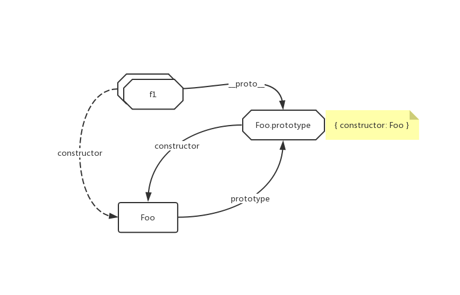
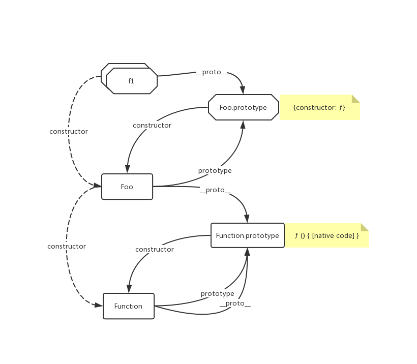

# JavaScript `prototype` 与 `__proto__`

JS 的原型链与继承经常令我感到困惑，理解起来有些费力；即使一时理解了，如果长期不应用或者复习，也容易遗忘。这里整理一下有关 `prototype` 的相关概念，并简单探讨一下为什么这些概念不易理解与记忆。

我们不妨先考察一下 `prototype` 所依赖的其他概念。

## 定义

### 对象

[ECMAScript](https://www.ecma-international.org/ecma-262/6.0/#sec-terms-and-definitions-object)
> member of the type Object
>
> Object 类型的成员

[MDN](https://developer.mozilla.org/zh-CN/docs/Learn/JavaScript/Objects/Basics#对象基础)
> An object is a collection of related data and/or functionality
>
> 对象是一个包含相关数据和~~方法~~功能的集合

对象可以用如下方法生成

```js
const o1 = {}
const o2 = new Object()
const o3 = Object.create(Object.prototype)
```

### 函数

[ECMAScript](https://www.ecma-international.org/ecma-262/6.0/#sec-terms-and-definitions-function)

> member of the Object type that may be invoked as a subroutine
>
> Object 类型的成员，可做为子程序被调用。

[MDN](https://developer.mozilla.org/zh-CN/docs/Web/JavaScript/Reference/Functions)

> 一般来说，一个函数是可以通过外部代码调用的一个“子程序”（或在递归的情况下由内部函数调用）……简而言之，它们是Function对象。

类似于对象，函数可以用如下方法生成

```js
const f1 = (x) => { console.log(x) } // 特别的，f1.prototype === undefined
const f2 = function(x) { console.log(x) }
const f3 = new Function("x", "console.log(x)") // 不推荐
const f4 = Function("x", "console.log(x)") // 不推荐
// const f5 = Object.create(Function.prototype) 并不会生成一个函数
```

### 构建函数

[ECMAScript](https://www.ecma-international.org/ecma-262/6.0/#sec-constructor)
> function object that creates and initializes objects
>
> 创建并初始化对象的函数对象

[MDN](https://developer.mozilla.org/zh-CN/docs/Learn/JavaScript/Objects/Object-oriented_JS#构建函数和对象)
> constructors provide the means to create as many objects as you need in an effective way, attaching data and functions to them as required
>
> 构建函数提供了创建您所需对象~~实例~~的有效方法，将~~对象的~~数据和~~特征~~函数按需联结至~~相应~~正在创建的这些对象。

一般来讲，任何函数都有机会成为构建函数，但依然有反例，比如 `Function.prototype`，[ECMAScript 的解释](https://www.ecma-international.org/ecma-262/6.0/#sec-properties-of-the-function-prototype-object)如下：

> The Function prototype object is the intrinsic object %FunctionPrototype%. The Function prototype object is itself a built-in function object. When invoked, it accepts any arguments and returns `undefined`. It does not have a [[Construct]] internal method so it is not a constructor.
>
> Function 的原型对象是内部对象 %FunctionPrototype%。Function 原型对象本身是一个内置的函数对象。当其被调用时，不论接受任何参数都将返回 `undefined`，他没有 [[Construct]] 内部方法，因此他不是构造函数。

### [[Construct]]

[ECMAScript](https://www.ecma-international.org/ecma-262/6.0/#sec-object-internal-methods-and-internal-slots) 表6第二项

> Creates an object. Invoked via the `new` or `super` operators. ... ... Objects that implement this internal method are called *constructors*. A function object is not necessarily a constructor and such non-constructor function objects do not have a [[Construct]] internal method.
>
> （用于）创建对象。通过 `new` 或 `super` 运算符调用。实现此内部方法的对象称之为*构建函数*。函数对象不一定是构造函数，此类非构造函数对象没有 [[Construct]] 内部属性。

### 对象的内部方法（Objects Internal Methods）

既然提到了 [[Construct]]，我们不妨大概浏览一下什么叫做内部方法。

[ECMAScript](https://www.ecma-international.org/ecma-262/6.0/#sec-object-internal-methods-and-internal-slots)

> The actual semantics of objects, in ECMAScript, are specified via algorithms called internal methods. Each object in an ECMAScript engine is associated with a set of internal methods that defines its runtime behaviour. These internal methods are not part of the ECMAScript language. They are defined by this specification purely for expository purposes. However, each object within an implementation of ECMAScript must behave as specified by the internal methods associated with it. The exact manner in which this is accomplished is determined by the implementation.
>
> ECMAScript 中对象的实际语义是通过称为内部方法的算法指定的。ECMAScript 引擎中的每个对象都与一组定义其运行时行为的内部方法相关联。这些内部方法不是 ECMAScript 语言的一部分。它们仅由出于说明目的而由本规范定义。但是，ECMAScript 所实现的每个对象必须按照与之关联的内部方法所指定的行为去运作。完成此操作的确切方式由（ECMAScript 引擎的）具体实现决定。

如果觉得不好理解可以参考[这里](https://stackoverflow.com/a/33081676)。总而言之，内部方法是由引擎实现的，他可以是由任何语言（比如 C++）实现的；实现的具体细节可以和 ECMAScript 所详细定义的不同，但是只要行为一致就可以了。

### `new`

[MDN](https://developer.mozilla.org/zh-CN/docs/Web/JavaScript/Reference/Operators/new)

> The new operator lets developers create an instance of a user-defined object type or of one of the built-in object types that has a constructor function.
>
> new 运算符创建一个用户定义的对象类型的实例或具有构造函数的内置对象的实例

当然，对于运算符，更重要的是其行为而非定义

> 当代码 new Foo(...) 执行时，会发生以下事情：
>
> 1. 一个继承自 Foo.prototype 的新对象被创建。
>
> 2. 使用指定的参数调用构造函数 Foo，并将 this 绑定到新创建的对象。new Foo 等同于 new Foo()，也就是没有指定参数列表，Foo 不带任何参数调用的情况。
>
> 3. 由构造函数返回的对象就是 new 表达式的结果。如果构造函数没有显式返回一个对象，则使用步骤1创建的对象。（一般情况下，构造函数不返回值，但是用户可以选择主动返回对象，来覆盖正常的对象创建步骤）

```js
const Foo = function() {}
const f1 = new Foo(1)
```

可视为

```js
const Foo = function() {}
// Foo.prototype = { constructor: Foo }
const __args__ = [1]
const __newFooInstance__ = Object.create(Foo.prototype)
// 步骤 1. 相当于
// const __newFooInstance__ = {} 
// __newFooInstance__.__proto__ = Foo.prototype

const __temp__ = Foo.apply(__newFooInstance__, __args__) // 步骤2.
const __isTempMemberOfObject__ = (typeof __temp__ === 'object' || typeof __temp__ === 'function')
  && __temp__ !== null
const f1 = __isTempMemberOfObject__ ? __temp__ : __newFooInstance__ // 步骤3.
// 有关 js 类型的定义参见 https://developer.mozilla.org/zh-CN/docs/Web/JavaScript/A_re-introduction_to_JavaScript#概览

```

### `prototype`

[ECMAScript](https://www.ecma-international.org/ecma-262/6.0/#sec-terms-and-definitions-prototype)

> object that provides shared properties for other objects
>
> 为其他对象提供共享属性的对象
>
> 当构造器创建一个对象，为了解决对象的属性引用，该对象会隐式引用构造器的“prototype”属性。通过程序表达式 constructor.prototype 可以引用到构造器的“prototype”属性，并且添加到对象原型里的属性，会通过继承与所有共享此原型的对象共享。另外，可使用 Object.create 内置函数，通过明确指定原型来创建一个新对象。

虽然定义指出原型是一个对象，但是 `Function` 似乎不这么认为，因为 `typeof Function.prototype === 'function'`

作为一个属性，只有函数类型的变量才会拥有 `prototype`。

### `__proto__`

```js
const Foo = function() {}
const f1 = new Foo()
f1.__proto__ === Foo.prototype // true
Object.getPrototypeOf(f1) === Foo.prototype // true

Object.getPrototypeOf(Foo) === Function.prototype // true
```

简单来讲，一个变量 f1 的 `__proto__`，就是生成 f1 的构造函数 Foo 的 `prototype`。

实际上 `__proto__` 已经成为一个非标准的属性了，不过目前大多数浏览器还是支持这个属性，ECMAScript 2015 提出使用 `Object.getPrototypeOf` 作为标准方法来寻找 `__proto__`，就如：

```js
Object.getPrototypeOf(Foo) === Function.prototype // true
```

但从语义上讲这就像是个令人困惑的绕口令——“Foo 的 prototype 不是 Foo.prototype 而是 Function.prototype”。

## `prototype` 与 `__proto__`

理清了所有的概念之后，我们回过头来看 `prototype` 与 `__proto__`。

首先我们先来单纯的考察一下 `f1` 有关的 `prototype` 与 `__proto__`。



上图中八边形代表 object 类型变量，圆角矩形代表 function 类型变量；实线代表属性，虚线代表关系。

三者的关系一目了然。但从上文的各种定义来看，`f1.__proto__ === Foo.prototype` 是 `new` 的功能，那么 `Foo.prototype` 又是何时被谁创建的呢？ 

我们考察一下 `Foo.__proto__`:



其中 `ƒ () { [native code] }` 代表的含义可以参见[这里](https://www.ecma-international.org/ecma-262/6.0/#sec-function.prototype.tostring)

显然我们可以合理的推测，“`Foo.prototype` 是在执行 `const Foo = new Function()` 时，由 `Function` 创建的”

这里也有一个令人困惑的地方，我们会发现：

```js
Object.getPrototypeOf(Function) === Function.prototype // true
```

那么我们能不能认为“`Function` 是由 `Function` 本身构建的”呢？

我认为答案是否定的。因为 `Function` 并不是经由 `new Function()` 操作产生的，他是一个[内置对象（built-in object）](https://developer.mozilla.org/zh-CN/docs/Web/JavaScript/Reference/Global_Objects)，如前文的所讲，`Function` 应当是由其内部方法 [[Construct]] 实现的，并不会存在诸如 `const Function = new Function()` 这种用户级别的代码去完成 `Function` 的构建。

`Function` 等内置对象的 `prototype` 与 `__proto__`，完全是由 ECMAScript 规定，由引擎直接实现的。不应当把这些内置对象的 `prototype` 与 `__proto__` 与用户级的函数例如 `Foo` 的 `prototype` 与 `__proto__` 混为一谈。

## 混淆与命名

至此，`prototype` 与 `__proto__` 之间的关系应该已经被理清了。

他们总易于混淆，是因为这两个属性一般都被翻译成“原型”。对于由函数 `Foo` 生成的变量 `f1` 来说，f1 的原型是 `f1.__proto__`，同时也是 `Foo.prototype`，到此为止还是很好理解；但与此同时 `Foo.prototype` 和 `Foo.__proto__` 都被称为 “Foo的原型”，这就十分令人困惑了。

从自然语义上讲，这样的混淆是无法避免的，我们来看 prototype 的含义：

> the first example of something, such as a machine or other industrial product, from which all later forms are developed
>
> 事物的第一个例子，例如机器或其他工业产品，所有后来的形式都是从中开发出的

显然，假如汽车博物馆收藏了五菱宏光的原型车，那么“五菱宏光这个型号的原型车”，和“我家上个月刚买的那台五菱宏光的原型车”，都指向博物馆的那辆馆藏，是完全合理的。

既然自然语义无法满足区分的需要，那么就需要新的语义去做区分。实际上 ECMAScript 的规范已经尝试做了区分。

 - 将 `Foo.prototype` 称之为 “Foo 原型对象”（Foo prototype object） 或者 “Foo 的 ‘`prototype`’ 属性”（Foo's '`prototype`' property）

 - 将 `Foo.__proto__` 称之为 “Foo 的原型”（the Foo's prototype）

在记忆上，只要了解上文中阐述的 `prototype` 与 `__proto__` 产生的时机，就能方便的区分开来了。一般的，对于用户级的代码：

 - `prototype` 创建于 `Function` 被调用时，即执行 `Function()`

 - `__proto__` 创建于 `new` 运算符运算时，即执行 `Object.create(Foo.prototype)`

 对于内置对象，则 `prototype` 与 `__proto__` 都是按 ECMAScript 规范所特指的。

 ## 后记

此文我试图理清 `prototype` 与 `__proto__` 的关系与区别，以可以清晰的讨论原型链的问题，但是还是遗留了一些问题没有得到回答：

 - `Object.create` 与 `new` 运算符的真实实现是什么？执行 `Object.create(Function.prototype)` 时究竟发生了什么？

 - 引擎对形如 `const f2 = function(x) { console.log(x) }` 的函数声明做了什么优化？为什么 [`new Function` 会引起优化问题](https://developer.mozilla.org/zh-CN/docs/Web/JavaScript/Reference/Functions#Function构造函数)？

 - 箭头函数对 `this` 和其他变量有什么影响？参考[这里](https://developer.mozilla.org/zh-CN/docs/Web/JavaScript/Reference/Functions/Arrow_functions)。

 - 能否在 ECMAScript 范围内做一些工作，使得 `prototype` 与 `__proto__` 的概念能被轻松的区分？

 - 原型污染攻击是什么？如何防范？