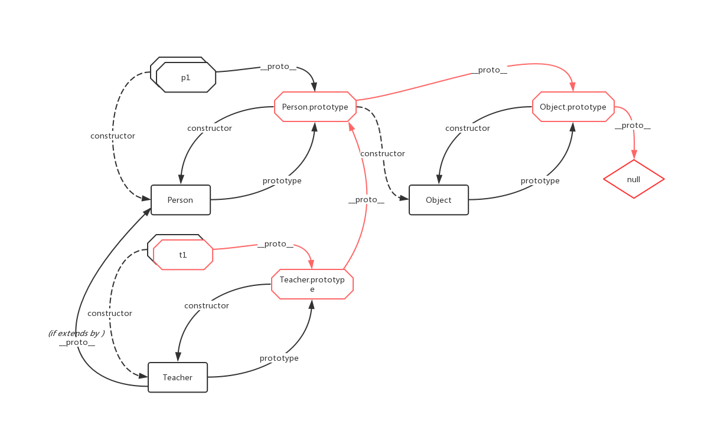

# JavaScript 原型链与继承

前文我们试图理清了 `prototype` 与 `__proto__` 的关系，这里试图探讨一下 JavaScript 中的原型链与继承，以及这种继承的实现与基于类的其他语言有什么异同。

## 原型链的简单例子

参考 [MDN 的这篇教程](https://developer.mozilla.org/zh-CN/docs/Web/JavaScript/Inheritance_and_the_prototype_chain)

```js
let Foo = function() {
  this.x = 1
  this.y = 2
}

let f1 = new Foo()   // {x: 1, y: 2}

Foo.prototype.y = 3
Foo.prototype.z = 4
```

此时，我们可以得到一条原型链：

```
Foo {x: 1, y: 2}
---> {y: 3, z: 4, constructor: ƒ}
---> Object.prototype
---> null
```

我们可以考察一下对于 `f1`，他的属性是如何被找到的

```js
console.log(f1.x)
// x 是 f1 的属性吗？是的，该属性的值为 1
console.log(f1.y)
// y 是 f1 的属性吗？是的，该属性的值为 2
// 原型上的 y 将被遮蔽
console.log(f1.z)
// z 是 f1 的属性吗？不是
// z 是 f1.__proto__ 的属性吗？是的，该属性的值为 4
console.log(f1.k)
// z 是 f1 的属性吗？不是
// z 是 f1.__proto__ 的属性吗？不是
// z 是 f1.__proto__.__proto__，即 Object.prototype 的属性吗？不是
// f1.__proto__.__proto__.__proto__ 为 null，停止搜索，返回 undefined
```

对于方法的继承，也是类似的

```js
let Foo = function(count) {
  this.count = count || 0
  this.addCount = function() {
    this.count++
    return this
  }
}

let f1 = new Foo()

Foo.prototype.addCount = function() {
  this.count += 2
  return this
}

Foo.prototype.subtractCount = function() {
  this.count -= 2
  return this
}

```

此时，我们可以得到一条原型链：

```
Foo {count: 0, addCount: ƒ}
---> {addCount: ƒ, subtractCount: ƒ, constructor: ƒ}
---> Object.prototype
---> null
```


```js
f1.addCount()
// Foo {count: 1, addCount: ƒ} f1.__proto__.addCount 被遮蔽
f1.subtractCount()
// Foo {count: -1, addCount: ƒ} 执行了 f1.__proto__.subtractCount
// 这里函数内的 this 会指向 f1 而非 f1.__proto__
```

所以我们得出结论，JavaScript 的原型链是这么工作的：

> JavaScript 对象有一个指向一个原型对象的链。当试图访问一个对象的属性时，它不仅仅在该对象上搜寻，还会搜寻该对象的原型，以及该对象的原型的原型，依次层层向上搜索，直到找到一个名字匹配的属性或到达原型链的末尾。

## 继承

现在让我们回到面向对象上来。假设我需要实现两个类，Person 与 Teacher，显然 Teacher 应当继承自 Person，我们应该如何做呢？

### 不使用 `class` 

为了针对性的展示原型链在继承中的作用，首先我们看一下不使用 `class` 的情况：

```js
const Person = function(props = {}) {
  const { firstName, lastName, age, gender } = props
  this.name = { first: firstName, last: lastName }
  this.age = age
  this.gender = gender
}

Person.prototype.come = function () {
  console.log(`${this.name.first} is coming.`)
}

Person.prototype.greeting = function() {
  console.log(`Hi! I'm ${this.name.first}.`)
}

const p1 = new Person({
  firstName: 'Ian',
  lastName: 'Zhang',
  age: 24,
  gender: 'male'
})

p1.come()       // Ian is coming.
p1.greeting()   // Hi! I'm Ian.
```

这里，我们想给 Teacher 更新一个 greeting 函数，让他能进行更正式的自我介绍并增加一个属性——学科。

```js
const Teacher = function(props = {}) {
  Person.call(this, props)

  this.subject = props.subject
}

const t1 = new Teacher({
  firstName: 'Ian',
  lastName: 'Zhang',
  age: 24,
  gender: 'male',
  subject: 'CS',
})
```

但是这时我们会发现，t1 既不会打招呼，也不会走过来：

```js
t1.coming()   // Uncaught TypeError: t1.coming is not a function
t1.greeting() // Uncaught TypeError: t1.greeting is not a function
```

这时，就需要我们连接他们的原型链了，考察以下方法：

```js
[A]
Teacher.prototype = Object.create(Person.prototype)
Teacher.prototype.constructor = Teacher
// "标准"方法
// Object.create(Person.prototype) 实际上会生成一个对象 

or [B]

Object.assign(Teacher.prototype, Object.create(Person.prototype))
// 这个方法无效
// Object.create(Person.prototype).__proto__ 不可枚举，Object.assign 会将其忽略
// 属性描述符参见 https://developer.mozilla.org/zh-CN/docs/Web/JavaScript/Reference/Global_Objects/Object/defineProperty#属性描述符

or [C]

Teacher.prototype = { constructor: Teacher, __proto__: Person.prototype }
// [C] 和 [A] 应该是完全相同的。当然这只是我的猜测

or [D]

Object.assign(Teacher.prototype, { __proto__: Person.prototype })
// 和 [B] 类似，这个方法无效
// __proto__ 不可枚举，Object.assign 会将其忽略

or [E]

Teacher.prototype = { ...Teacher.prototype, __proto__: Person.prototype }
// 假设 Teacher.prototype 仅有 constructor 和 __proto__ 两个属性
// [E] 和 [C] 是完全相同的

or [F]

Teacher.prototype.__proto__ = Person.prototype
// 可以影响到已经生成的实例 t1

or [G]

Object.setPrototypeOf(t1.__proto__ Person.prototype)
// 仅影响到已经生成的实例 t1

or [H]

t1.__proto__.__proto__ = Person.prototype
// 仅影响到已经生成的实例 t1
```

在这里我们选用标准写法 [A]，之后生成新的 Teacher 实例

```js
const t2 = new Teacher({
  firstName: 'Rohry',
  lastName: 'Snow',
  age: 22,
  gender: 'female',
  subject: 'biology',
})

t2.greeting() // Hi! I'm Rohry.
t2.come()     // Rohry is coming.
```

之后我们可以给 Teacher 的原型对象增加方法，以屏蔽 Person 原型对象中的方法

```js
Teacher.prototype.greeting = function() {
  console.log(`Hello. My name is Mx. ${this.name.last}, and I teach ${this.subject}.`)
}

t1.greeting() // Hello. My name is Mx. Zhang, and I teach CS.
t2.greeting() // Hello. My name is Mx. Snow, and I teach biology.
```

### 使用 `class`

ECMAScript6 引入了一套新的关键字用来实现 [class](https://developer.mozilla.org/zh-CN/docs/Web/JavaScript/Reference/Classes)，对于一开始就使用 ES5/6 或者使用基于类语言的开发者来说，更熟悉这种写法。

```js
class Person {
  constructor(props) {
    const { firstName, lastName, age, gender } = props
    this.name = { first: firstName, last: lastName }
    this.age = age
    this.gender = gender
  }

  come = () => {
    console.log(`${this.name.first} is coming.`)
  }

  greeting = () => {
    console.log(`Hi! I'm ${this.name.first}.`)
  }
}

class Teacher extends Person {
  constructor(props) {
    super(props)

    this.subject = props.subject
  }

  greeting = () => {
    console.log(`Hello. My name is Mx. ${this.name.last}, and I teach ${this.subject}.`)
  }
}
```

实际上 `class` 就是前文所展示操作的语法糖，两者基本等价。两者也可以混用，也是没有问题的。

综上，`t1` 的原型链如下图所示：

