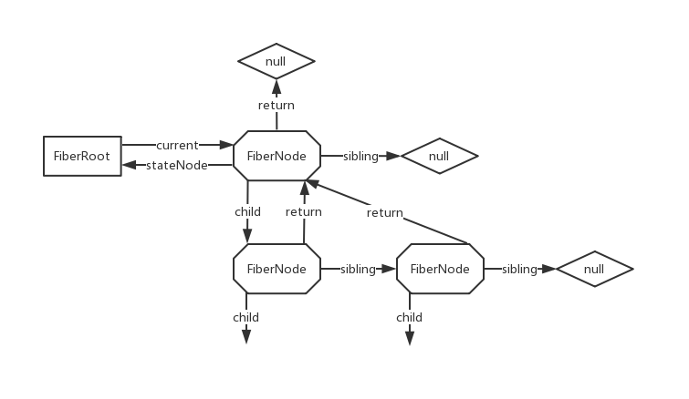
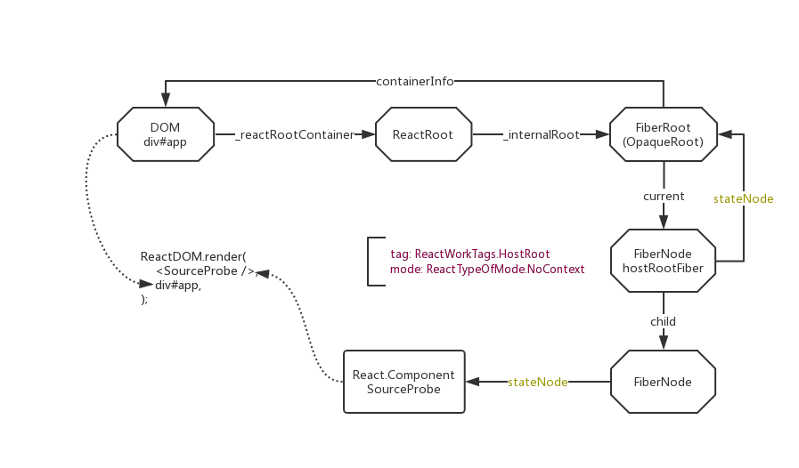

# React 勘测笔记 II - render 的“准备”

## [ReactDom.render](https://zh-hans.reactjs.org/docs/react-dom.html#render)

:dolphin: [ReactDom.render](https://github.com/TAUnionOtto/react-interpretation/blob/master/packages/react-dom/src/client/ReactDOM.js#L711)

我们继续基于如下代码讨论：

```js
// [code A]
import React from 'react';
import ReactDOM from 'react-dom';

class SourceProbe extends React.Component {
  render() {
    return <div id="root">Rua!</div>
  }
}

const SourceProbeElement = React.createElement(SourceProbe)
const rootContainer = document.getElementById('app');
ReactDOM.render(SourceProbeElement, rootContainer);
```

上文我们已经理清了 `SourceProbeElement` 生成的过程和结果，这篇文章从 `ReactDOM.render` 开始，看看执行 `render` 的“一瞬”究竟发生了什么。

`ReactDom.render` 作为 React 操作 DOM 的入口，申明如下：

```js
render(
  element: React$Element<any>,
  container: DOMContainer,
  callback: ?Function,
) {}
```

其中只是检查了一下 `container` 的有效性，就立即调用了 `legacyRenderSubtreeIntoContainer`。

## `legacyRenderSubtreeIntoContainer`

:dolphin: [ReactDom.js @function legacyRenderSubtreeIntoContainer](https://github.com/TAUnionOtto/react-interpretation/blob/master/packages/react-dom/src/client/ReactDOM.js#L559)

全文搜索这个函数，我们发现实际上只有四处调用了此函数。

- 首先我们忽略服务器端渲染所使用的 `hydrate` 方法；

- 第二处即为 `ReactDom.render`；

- 第三处是在即将废弃的方法 `unstable_renderSubtreeIntoContainer` 中调用的，这里也不展开讨论了；

- 最后一处是在 [`unmountComponentAtNode`](https://zh-hans.reactjs.org/docs/react-dom.html#unmountcomponentatnode) 中被调用。

  > `unmountComponentAtNode` 从 DOM 中卸载组件，并将其事件处理器（event handlers）和 state 一并清除。

这个函数做了两件事：

- 初始化 `container._reactRootContainer`

  `container` 没有 `_reactRootContainer` 时进行初始化，调用栈：
  
  - :dolphin: [`legacyCreateRootFromDOMContainer`](https://github.com/TAUnionOtto/react-interpretation/blob/master/packages/react-dom/src/client/ReactDOM.js#L508)

    首先清除 `rootContainer` 内所有子节点，随后新建一个 `ReactRoot` 并返回。
  
  - :dolphin: [`ReactDOM.js @class ReactRoot`](https://github.com/TAUnionOtto/react-interpretation/blob/master/packages/react-dom/src/client/ReactDOM.js#L365)
  
    调用 `ReactFiberReconciler.createContainer` 创建一个 `OpaqueRoot` 对象，并赋值到成员变量 `_internalRoot`。

    ReactRoot 有四个成员方法：

    - render
    - unmount
    - legacy_renderSubtreeIntoContainer
    - createBatch

    前三个方法实际上都是调用了 `ReactFiberReconciler.updateContainer`，也是 FiberReconciler 处理流程的起点。后文我们会展开来讲。

  - :dolphin: [`ReactFiberReconciler.createContainer`](https://github.com/TAUnionOtto/react-interpretation/blob/master/packages/react-reconciler/src/ReactFiberReconciler.js#L275)

    从这里开始我们就进入了 Fiber Reconciler 的范围了。与 Fiber Reconciler 相对应的，是之前 React 15 版本所使用的 Stack Reconciler。在 Reconciler 之外的概念，我们暂且认为是没有改变的，即：

    ```js
    User ---render/setState---> Elements ---Reconciler---> DOM
    ```

    `createContainer` 返回一个 `OpaqueRoot` 对象，然而在前文定义中有 `type OpaqueRoot = FiberRoot;`。这里意图很明显，React 希望把 Reconciler 当做一个通用而独立的概念，目前 Reconciler 只有 Fiber Reconciler 一种，但不意味着以后不会有新的 Reconciler。以后只要保证 `OpaqueRoot` 结构和接口不变，新增一个 Reconciler 将有章可循。

  - :dolphin: [`ReactFiberRoot.createFiberRoot`](https://github.com/TAUnionOtto/react-interpretation/blob/master/packages/react-reconciler/src/ReactFiberRoot.js#L139)

    `createFiberRoot` 只做了两件事：创建 `hostRootFiber`，初始化 `FiberRoot`。

  - :dolphin: [`ReactFiber.createHostRootFiber`](https://github.com/TAUnionOtto/react-interpretation/blob/master/packages/react-reconciler/src/ReactFiber.js#L506)

    这里 `isConcurrent` 为 `false`，我们将不对 fiber 的模式做限制。

  - :dolphin: [`ReactFiber.js @function createFiber`](https://github.com/TAUnionOtto/react-interpretation/blob/master/packages/react-reconciler/src/ReactFiber.js#L391)

  - :dolphin: [`ReactFiber.js @class FiberNode`](https://github.com/TAUnionOtto/react-interpretation/blob/master/packages/react-reconciler/src/ReactFiber.js#L298)

    其中 FiberNode 成员变量的定义参见 :dolphin: [type ReactFiber.Fiber](https://github.com/TAUnionOtto/react-interpretation/blob/master/packages/react-reconciler/src/ReactFiber.js#L87)。

    对于 FiberNode，他和他有关的节点关系如下图所示：

    

    可以清晰的看到，Fiber 架构将 Stack 中的树结构转化为了链表结构，这样可以使遍历或者 diff 从递归变成了遍历，对每个节点的操作即使被中断，也可以从中断处继续执行。这种特性同时可以让 Fiber Reconciler 做到在每个节点结束时，都有能力中断整个任务，去处理更重要的任务。

    除此之外，FiberNode 还有：

    - 用来记录 FiberNode 与宿主元素关系的 `tag`、`key`、`elementType`、`type` 及 `stateNode` 字段。
    - 用来准备处理 ref 的字段 `ref`。
    - 用来检查和记录 element 变化的 `pendingProps`、`pendingProps`、`updateQueue`、`memoizedState` 和 `contextDependencies`。
    - 控制 fiber 工作策略的字段 `mode`。
    - 用于构建 `Effect List` 的字段 `effectTag`、`nextEffect`、`firstEffect` 及 `lastEffect`。
    - 用于考察是否会超时的字段 `expirationTime` 和 `childExpirationTime`。
    - 用于在 element tree 变化时记录 fiber 快照的 `alternate`。

    我们将在对 `render` 和 `setState` 的考察中，再详细解读这些字段的作用。

  对 `FiberNode` 的结构有了初步的了解之后，我们回到 :dolphin: [`ReactFiberRoot.createFiberRoot`](https://github.com/TAUnionOtto/react-interpretation/blob/master/packages/react-reconciler/src/ReactFiberRoot.js#L161)，我们发现 `uninitializedFiber` 实际上被定义了的值只有：

  ```js
  {
    tag: ReactWorkTags.HostRoot,
    mode: ReactTypeOfMode.NoContext,
  }
  ```

  非常真实的“未定义” fiber。FiberRoot 的其他字段，除了指向 DOM 根节点的 `containerInfo` 外，其他字段似乎都在处理有关 `ExpirationTime` 的功能，我们会在后面讲到他们的作用。最终，我们发现 `fiberRoot` 实际上被定义了的值只有：

  ```js
  {
    containerInfo: div#app,
    current: uninitializedFiber,
  }
  ```

- 执行 `container._reactRootContainer.render`

见后文 [render 的“运行”](https://github.com/TAUnionOtto/Blog/blob/master/06.React%20%E5%8B%98%E6%B5%8B%E7%AC%94%E8%AE%B0%20III%20-%20render%20%E7%9A%84%E2%80%9C%E8%BF%90%E8%A1%8C%E2%80%9D.md)

## 小结

至此，我们成功初始化了 DOM 根节点的 `_reactRootContainer` 属性，目前我们掌握的结构大致如下：


