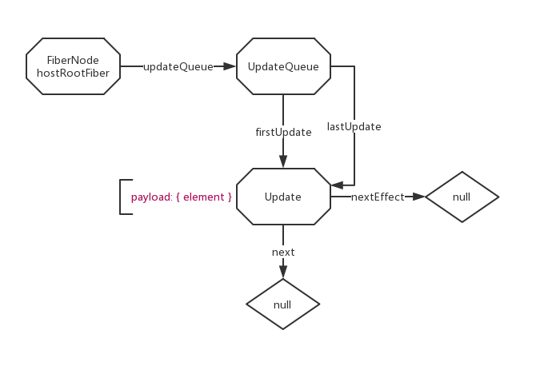
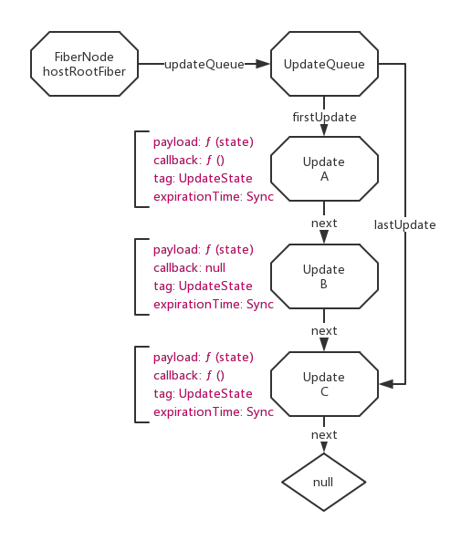
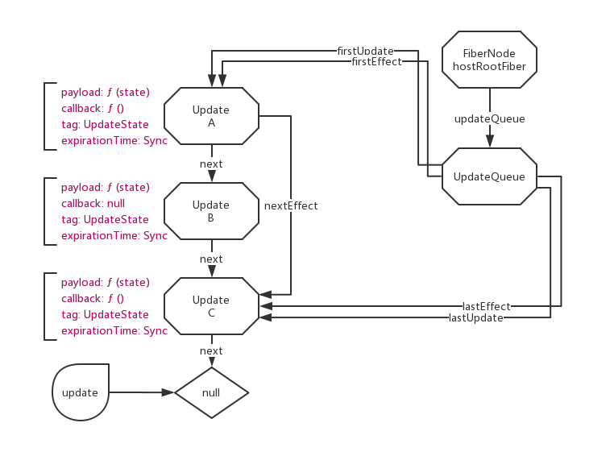

# React 勘测笔记 IV - ReactUpdateQueue

:dolphin: [ReactUpdateQueue.js](https://github.com/TAUnionOtto/react-interpretation/blob/master/packages/react-reconciler/src/ReactUpdateQueue.js)

## ReactUpdate 的结构

:dolphin: [type Update\<State\>](https://github.com/TAUnionOtto/react-interpretation/blob/master/packages/react-reconciler/src/ReactUpdateQueue.js#L109)

## ReactUpdateQueue 的结构

:dolphin: [type ReactUpdateQueue](https://github.com/TAUnionOtto/react-interpretation/blob/master/packages/react-reconciler/src/ReactUpdateQueue.js#L115)

## 一般情况下的调用过程

单次 `ReactDOM.render` 和 `setState` 调用 UpdateQueue 的流程大致相同，都是：

```js
createUpdate -> enqueueUpdate -> processUpdateQueue -> commitUpdateQueue
```

其中各方法调用的时机和两者生成的 update 都不尽相同，具体有兴趣的可以自行打断点查阅。

`setState` 触发的流程其实有两种情况：

- DOM event listener 触发的 `setState`

  由 `setState` 调用 create 和 enqueue；由 listener 调用 processUpdateQueue。

- setTimeout 触发的 `setState`

  由 `setState` 调用 create 和 enqueue；且由 `setState` 调用 processUpdateQueue。

这两种流程下，如果传递了 `setState` 的第二个参数（即执行完成后的回调），则最后会调用 commitUpdateQueue。

<!-- ### ReactDOM.render

- ReactDOM.render
- :dolphin: [ReactFiberReconciler.scheduleRootUpdate](https://github.com/TAUnionOtto/react-interpretation/blob/master/packages/react-reconciler/src/ReactFiberReconciler.js#L115)
  - createUpdate
  - enqueueUpdate
    - createUpdateQueue
  - :dolphin: [ReactFiberReconciler.js @function scheduleWork](https://github.com/TAUnionOtto/react-interpretation/blob/master/packages/react-reconciler/src/ReactFiberReconciler.js#L1855)
  - call to :dolphin: [ReactFiberReconciler.js @function performWorkOnRoot](https://github.com/TAUnionOtto/react-interpretation/blob/master/packages/react-reconciler/src/ReactFiberReconciler.js#L2382)
    - :dolphin: [ReactFiberReconciler.js @function renderRoot](https://github.com/TAUnionOtto/react-interpretation/blob/master/packages/react-reconciler/src/ReactFiberReconciler.js#L1223)
      - call to :dolphin: [ReactFiberBeginWork.beginWork](https://github.com/TAUnionOtto/react-interpretation/blob/master/packages/react-reconciler/src/ReactFiberBeginWork.js#L1893)
      - call :dolphin: [ReactFiberBeginWork.js @function updateHostRoot](https://github.com/TAUnionOtto/react-interpretation/blob/master/packages/react-reconciler/src/ReactFiberBeginWork.js#L838)
        - processUpdateQueue
    - :dolphin: [ReactFiberReconciler.js @function completeRoot](https://github.com/TAUnionOtto/react-interpretation/blob/master/packages/react-reconciler/src/ReactFiberReconciler.js#L2459)
      - call to commitUpdateQueue

### setTimeout 中的 setState

- Component.prototype.setState
- :dolphin: [ReactFiberClassComponent.js @classComponentUpdater.enqueueSetState](https://github.com/TAUnionOtto/react-interpretation/blob/master/packages/react-reconciler/src/ReactFiberClassComponent.js#L183)
  - createUpdate
  - enqueueUpdate
    - createUpdateQueue
  - :dolphin: [ReactFiberReconciler.js @function scheduleWork](https://github.com/TAUnionOtto/react-interpretation/blob/master/packages/react-reconciler/src/ReactFiberReconciler.js#L1855)
  - :dolphin: [ReactFiberReconciler.js @function requestWork](https://github.com/TAUnionOtto/react-interpretation/blob/master/packages/react-reconciler/src/ReactFiberReconciler.js#L2117)
  - :dolphin: [ReactFiberScheduler.renderRoot](https://github.com/TAUnionOtto/react-interpretation/blob/master/packages/react-reconciler/src/ReactFiberScheduler.js#L1223)
  - call to :dolphin: [ReactFiberBeginWork.beginWork](https://github.com/TAUnionOtto/react-interpretation/blob/master/packages/react-reconciler/src/ReactFiberBeginWork.js#L1893)
  - call :dolphin: [ReactFiberBeginWork.js @function updateClassComponent](https://github.com/TAUnionOtto/react-interpretation/blob/master/packages/react-reconciler/src/ReactFiberBeginWork.js#L624)
  - call :dolphin: [ReactFiberClassComponent.updateClassInstance](https://github.com/TAUnionOtto/react-interpretation/blob/master/packages/react-reconciler/src/ReactFiberClassComponent.js#L1002)
    - resetHasForceUpdateBeforeProcessing
    - processUpdateQueue
    - checkHasForceUpdateAfterProcessing

### event callback 中的 setState

[ReactFiberScheduler.js @function requestWork](https://github.com/TAUnionOtto/react-interpretation/blob/master/packages/react-reconciler/src/ReactFiberScheduler.js#L2117) 中 `isUnbatchingUpdates` 为 `false`，故没有执行 `performWorkOnRoot`。

这里 `performWorkOnRoot` 最终是由 [ReactDOMEventListener.js @function dispatchInteractiveEvent](https://github.com/TAUnionOtto/react-interpretation/blob/master/packages/react-dom/src/events/ReactDOMEventListener.js#L184) 触发的。

换言之，`setTimeout` 中 `processUpdateQueue` 会被调用若干次，而 event callback 中，`processUpdateQueue` 仅会被调用一次。 -->

## enqueueUpdate

从上文所知，如果不考虑 `fiber.alternate`，第一次 `enqueueUpdate` 之后，我们可以得到如下的结构：



我们可以注册这样一个回调，构造一个简单的、拥有成多个 Update 节点的 UpdateQueue；为了展示 UpdateQueue 中 effect 的作用，我们给其中两个 `setState` 添加回调。

```js
// code [A]
onClickCounter = () => {
    this.setState(
      (state) => { return { count: state.count + 1 } },
      () => { console.log('updateA') },
    );
    this.setState((state) => { return { count: state.count + 1 } });
    this.setState(
      (state) => { return { count: state.count + 1 } },
      () => { console.log('updateC') },
    );
}
```

三次 enqueue 后，我们会得到一个如下的结构：



## processUpdateQueue

这里个方法就是在执行所有的 update。

- ensureWorkInProgressQueueIsAClone

  确保 work-in-progress 中的 queue 是一份克隆，同时后续操作是首先作用在这份克隆上而非 current.updateQueue 上的。

- 遍历列表

  根据 update 的 expirationTime 确认其优先程度。

  高优先级的 update 会首先执行 `getStateFromUpdate` 方法。这个方法会根据 update.tag 操作 queue 的 state：

  - 默认执行 `UpdateState`，即将 `update.payload` 和 state 合并，或执行 `update.payload` 函数，将结果和 state 合并。
  - `ReplaceState`，将 `update.payload`（同样的当其为函数时将其运行结果）替换当前 state。
  - `CaptureUpdate`，在 fiber 报错时会 enqueue 这种类型的 update，这里会给 fiber 打上相应的 tag，不操作 state。
  - `ForceUpdate`，将 `hasForceUpdate` 置为 `true`，具体作用见 :dolphin: [ReactFiberClassComponent.js](https://github.com/TAUnionOtto/react-interpretation/blob/master/packages/react-reconciler/src/ReactFiberClassComponent.js)，不操作 state。

  之后，将有 `callback` 的 update 放入 effect 链表尾部。effect 链表会在 `commitUpdateQueue` 中被调用。

  低优先级的会被跳过，*第一个*被跳过的 update 会被记为 `newFirstUpdate`，这时的 state 会被记为 `newBaseState`，也就是说，以后再执行这个 queue，其会从第一个被跳过的 update 开始重新遍历。同时 `newExpirationTime` 会记录这些被跳过的 update 中最高的优先级，以保证下一次 updateQueue 被及时的遍历。

  [A] 中生成的 update 优先级均为最高的 `Sync`，tag 均为默认的 `UpdateState`（0），故没有 update 会被跳过。

  我们会得到如下结果：

  

- 遍历错误捕获列表

  updateQueue 除了维护普通的 update 链表外，还会维护一个存放 fiber 报错相关的 update 链表。可以通过 `enqueueCapturedUpdate` 向 updateQueue 中添加这种节点。比如 :dolphin: [ReactFiberUnwindWork.throwException](https://github.com/TAUnionOtto/react-interpretation/blob/master/packages/react-reconciler/src/ReactFiberUnwindWork.js#L190).

  错误捕获 update 的添加和遍历和上文遍历普通的 update 链表没有大的区别。

  对错误捕获的遍历同样会影响 state 和 `newExpirationTime`，但其对低优先级 update 和 effect 的相关操作是与遍历普通节点相独立的，其操作的是 `newFirstCapturedUpdate`、`firstCapturedEffect` 和 `lastCapturedEffect`。

- 更新 UpdateQueue

  为了将 `workInProgress` 标记为已完成，或维持队列中可能会有低优先级的 updates，最后会进行一些对 UpdateQueue 的更新。

  最终，一个已完成的 UpdateQueue 最终会使 `workInProgress.expirationTime === NoWork`；

  未完成的 UpdateQueue 会更新 `baseState`、`firstUpdate` 和 `firstCapturedUpdate`，并将 `workInProgress.expirationTime` 置为被跳过的 update 中最高的优先级，以供下一次运行。

## setState 的各种表现

通过分析 `enqueueUpdate` 和 `processUpdateQueue`，我们可以解释以下代码的区别：

```js
constructor(props) {
  super(props)

  this.state = { count: 1 }
}

// callback A，最终 this.state.count = 2
onClickCounter = () => {
  this.setState({ count: this.state.count + 1 });
  this.setState({ count: this.state.count + 1 });
  this.setState({ count: this.state.count + 1 });
}

// callback B，最终 this.state.count = 4
onClickCounter = () => {
  setTimeout(() => {
    this.setState({ count: this.state.count + 1 });
    this.setState({ count: this.state.count + 1 });
    this.setState({ count: this.state.count + 1 });
  }, 500);
}

// callback C，最终 this.state.count = 4
onClickCounter = () => {
  this.setState((state) => { return { count: state.count + 1 } });
  this.setState((state) => { return { count: state.count + 1 } });
  this.setState((state) => { return { count: state.count + 1 } });
}
```

[A] 实际上往队列里加入了三个 `payload = { count: 2 }` 的 update，每个 update 计算 state 后都会将 `count` 更新为 2，故最后结果依然是 2；

[B] 实际执行了三次 `processUpdateQueue`，虽然 UpdateQueue 本身被复用了，但是实际上是运行了三次仅有一个 update 的 UpdateQueue。每次执行 `processUpdateQueue` 时，UpdateQueue 初始的 `baseState` 分别为 2、3、4。

[C] 实际上往队列里加入了三个 `payload = (state) => { return { count: state.count + 1 } }` 的 update，也就是说每个 update 在计算时，都使用到已经加 1 的 `resultState`，故结果是 4。

三者的调用栈异同这里请自行考察，在后面的文章中有机会我会专门分析 `setState` 的调用过程。

## commitUpdateQueue

这个方法实际上只做了三件事：

- 若错误捕获 update 已处理完毕或不需要处理，重置错误捕获相关的字段。
- 处理普通 update 和错误捕获 update 的 effect 队列，即他们所需要执行的回调。比如确保 `setState` 的回调在文档标识的时机触发。
- 重置各 effect 队列。
