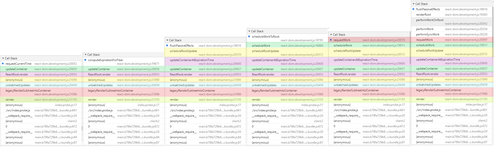
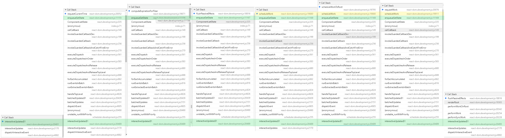
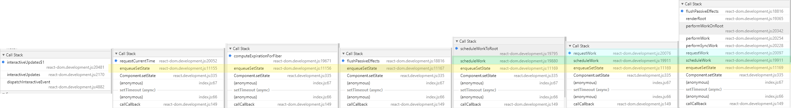

# React 勘测笔记 V - ReactFiberScheduler

:dolphin: [ReactFiberScheduler.js](https://github.com/TAUnionOtto/react-interpretation/blob/master/packages/react-reconciler/src/ReactFiberScheduler.js)

v16.9.0-rc.0 中这个文件已经被更名为 [ReactFiberWorkLoop.js](https://github.com/facebook/react/blob/v16.9.0-rc.0/packages/react-reconciler/src/ReactFiberWorkLoop.js)，其实现也发生了不小的改变，但对外接口没有发生大的变化。粗略来看新的 WorkLoop 在代码上更容易理解，他填平了 Scheduler 中的布尔值地狱，并用一种类似于“执行上下文”（Context）的概念统一的代替了这些更改逻辑分散在各处的布尔值们。目前这个文件还留着大量的 TODO，等这个文件稳定之后，我会试着重新组织一篇 WorkLoop 的解析。

## React.render 调用过程



- ReactDom.render
- call to :dolphin: [ReactFiberReconciler.updateContainer](https://github.com/TAUnionOtto/react-interpretation/blob/master/packages/react-reconciler/src/ReactFiberReconciler.js#L287)
  - requestCurrentTime
  - computeExpirationForFiber
  - :dolphin: [ReactFiberReconciler.updateContainerAtExpirationTime](https://github.com/TAUnionOtto/react-interpretation/blob/master/packages/react-reconciler/src/ReactFiberReconciler.js#L165)
    - :dolphin: [ReactFiberReconciler.js @function scheduleRootUpdate](https://github.com/TAUnionOtto/react-interpretation/blob/master/packages/react-reconciler/src/ReactFiberReconciler.js#L115)
      - flushPassiveEffects
      - scheduleWork
        - scheduleWorkToRoot
        - requestWork
        - call to renderRoot
          - flushPassiveEffects
        - call to completeRoot
          - commitRoot

## dom event 触发的 setData



- :dolphin: [ReactDOMEventListener.js @function dispatchInteractiveEvent](https://github.com/TAUnionOtto/react-interpretation/blob/master/packages/react-dom/src/events/ReactDOMEventListener.js#L184)
- call to interactiveUpdates
- call to Component.prototype.setState
  - :dolphin: [ReactFiberClassComponent.js @classComponentUpdater.enqueueSetState](https://github.com/TAUnionOtto/react-interpretation/blob/master/packages/react-reconciler/src/ReactFiberClassComponent.js#L183)
    - requestCurrentTime
    - computeExpirationForFiber
    - flushPassiveEffects
    - scheduleWork
      - scheduleWorkToRoot
      - requestWork
- call to renderRoot
  - flushPassiveEffects
  - call to commitRoot

## setTimeout 触发的 setData



- call to Component.prototype.setState
  - :dolphin: [ReactFiberClassComponent.js @classComponentUpdater.enqueueSetState](https://github.com/TAUnionOtto/react-interpretation/blob/master/packages/react-reconciler/src/ReactFiberClassComponent.js#L183)
    - requestCurrentTime
    - computeExpirationForFiber
    - flushPassiveEffects
    - scheduleWork
      - scheduleWorkToRoot
      - requestWork
      - call to renderRoot
        - flushPassiveEffects
        - call to commitRoot

## 一般情况下的调用过程

单次 `ReactDOM.render` 和 `setState` 调用 Scheduler 的流程大致相同（这里暂且先考察暴露出去的方法），都是：

```js
   requestCurrentTime -> computeExpirationForFiber
-> flushPassiveEffects
-> scheduleWork -> scheduleWorkToRoot -> requestWork
-> flushPassiveEffects
-> commitRoot
```

## requestCurrentTime

这个方法是被调度器用来计算过期时间的。在这个方法的注释中，React 申明了这个这个方法应当实现的功能，即:

> However, if two updates are scheduled within the same event, we should treat their start times as simultaneous, even if the actual clock time has advanced between the first and second call.
>
> 如果一个事件触发后调度了两个更新，我们应当将他们的开始时间视为一致的，即使在这两次更新的调度方法被调用之间，实际的机器时钟已经过去了一些时间了。

在我的理解中，这里强调 “actual clock time has advanced” 即是指两次 `setState` 调用之间可能出现的时间差，小到函数调用时 CPU 时钟纳秒级的差别，大到两次调用间的复杂逻辑甚至打断点导致的时间差，在 React 的设计中均应当是被抹平的。

*注意* `setTimeout` 和 `Promise` 所产生的等待并不会造成这种时间差，如果你对 eventLoop 有基本的了解，你应该明白 `dispatchInteractiveEvent` 可是不会等待你所注册的 callback 中所写的这些“任务”的。

接下来我们看 React 是如何抹平这一时间差的。

- 判断当前是否在 render 过程中，若在，则返回 `currentSchedulerTime`

  布尔值 `isRendering` 是用来判断当前是否在 render 过程中的，仅有在执行 `performWorkOnRoot` 和 `commitPassiveEffects` 的过程中，这个布尔值才会被置为 `true`。

  一个典型的“在 render 过程中执行 `requestCurrentTime`”的例子就是在 `setState` 的回调中执行 `setState`：

  ```js
  this.setState(
    { count: this.state.count + 1 },
    () => { this.setState({ count: this.state.count + 1 }); },
  );
  ```

  从前文我们了解到，`setState` 的回调是由 `updateQueue.commitUpdateQueue` 遍历 effect 链表时执行的，但是我们并没有详细解释他是被谁调用的。

  实际上 `commitUpdateQueue` 会在 `performWorkOnRoot` 执行时，通过执行生命周期的函数 :dolphin: [ReactFiberCommitWork.commitLifeCycles](https://github.com/TAUnionOtto/react-interpretation/blob/master/packages/react-reconciler/src/ReactFiberCommitWork.js#L383)，在生命周期 `componentDidMount` 或 `componentDidUpdate` 之后被执行。

  所以这时候 `isRendering === true`。当然回调中的这次 `setState` 执行时，上一批 Updates 已经被处理了。虽然两次 `setState` 不会在同一批次中执行，但是第二次 `setState` 的优先级是可以被保证的。

- `findHighestPriorityRoot()`

  计算并检查是否有正在等待的任务。这个函数会遍历所有被调度的 FiberRoot，并算出优先级最高的 ExpirationTime 与 FiberRoot，赋值到 `nextFlushedRoot` 与 `nextFlushedExpirationTime` 中。

  Scheduler 的两个相关的全局变量：`firstScheduledRoot` 和 `lastScheduledRoot` 指向被调度 FiberRoot 环链表的头和尾。

- 判断当前是否有没有执行、正在等待的任务。若没有，计算新的渲染时间，

<!-- 首先 Scheduler 维护了两个 ExpirationTime，`currentSchedulerTime` 与 `currentRendererTime`。他们的初始值相同，都是 `msToExpirationTime(now())`。注意初始值是在 React 初始化（即 ReactFiberScheduler.js 被 import 时）初始化的。 -->

<!-- - `currentRendererTime`

  即渲染时间，渲染时间可以随时更新，他的存在仅仅是为了减少对 `performance.now` 的调用。渲染时间通过函数 `recomputeCurrentRendererTime` 更新。

- `currentSchedulerTime`

  即调度时间，调度时间只能在当前没有正在等待的任务，且我们能确定我们不处于任何事件触发的过程中时，才会被更新。

  这两个 ExpirationTime 更新时机的逻辑非常的繁复，而且在 16.9 中被砍掉了，这里就不多做展开了。 -->

<!-- 咕咕咕 -->
