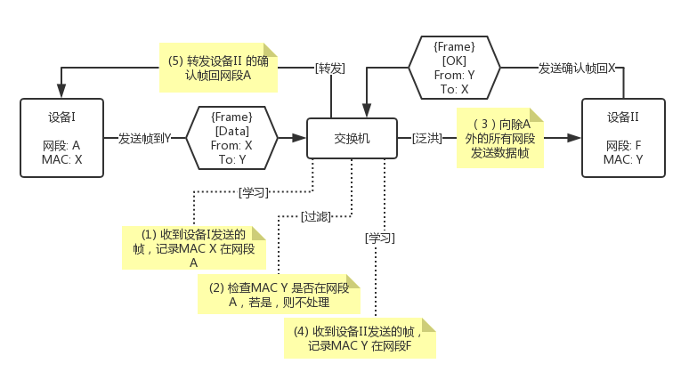
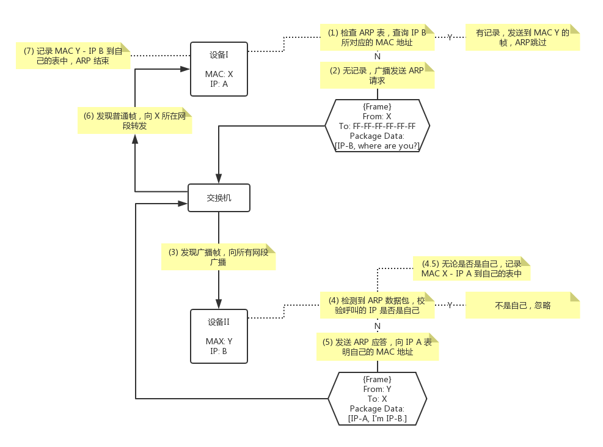
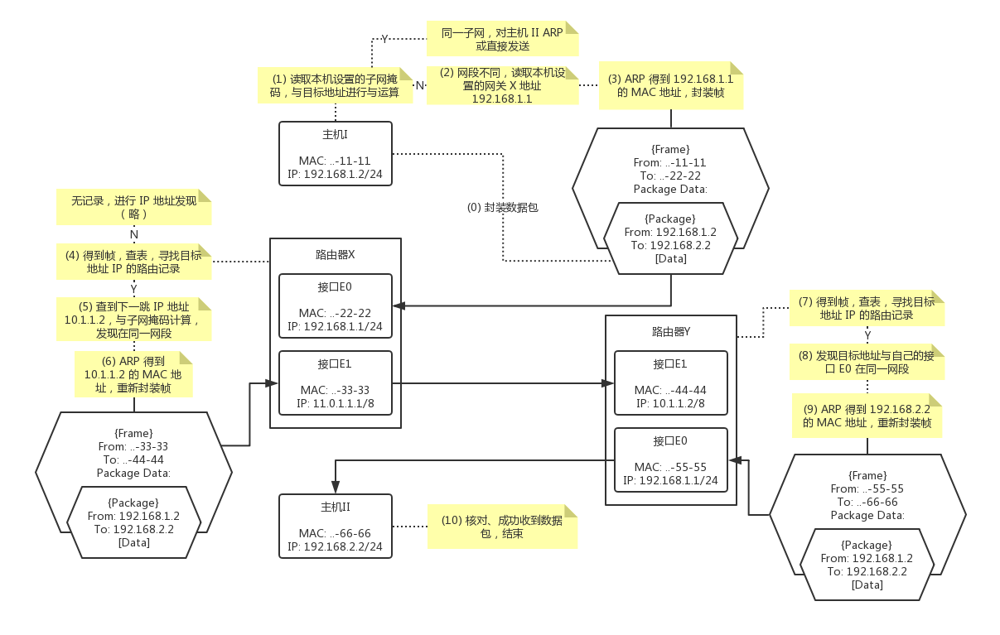

# OSI 七层网络模型简介

## 物理层

- 数据单元称谓

  比特（bit）

- 作用与实现

  使二进制数据在物理媒体上传输。这一层负责定义数据的物理表示，比如铜线中的高低电平、光纤中光的通断；也负责物理上的组织，比如载波聚合、调制解调、时分复用等等。

- 在这一层工作的设备与协议

  调制解调器，电力线，光纤，同轴电缆，集线器……

## 数据链路层

- 数据单元称谓

  帧（frame）

- 作用与实现

  屏蔽不同物理层的差异，并对网络层提供服务。负责对物理网络的寻址，物理层传输中错误的侦测和纠错；同时定义了什么是数据帧，什么作为其边界。

  帧的实现是在一段数据前后加上表头和表尾：表头包含了这个帧的物理地址（MAC）和帧的校验和；表尾是一串用来指示其末端的特殊比特串。

- 在这一层工作的设备与协议

  交换机、WiFi、PPPoE、GPRS……

- 例子：交换机工作过程

  

  - 各设备同物理层直接连接的，称他们在同一网段。当然日常生活中使用交换机，一个网段上一般只有一台设备。

  - 过程（1）和（4）会构建一张“MAC-网段”查询表。表中每条记录还会记录其最后被访问的时间，过长未访问的记录将会被清除。这一机制叫做`[老化]`。

## 网络层

- 数据单元称谓

  数据包（package）

- 作用与实现

  提供一种方法，通过一个或多个网络，将不定长的数据从源地址发送到目标地址。即提供对多个网络间的连接。

  - 无连接通讯：这一层接收方不做送达确认的回执。
  - 主机寻址：单个网络中的每一个主机，都应当有一个地址来确定其位置。换言之不同网络中的主机可以有同一个地址。
  - 讯息转发：由设备（路由器或网关）在多个子网间进行广域通讯。

- 在这一层工作的设备与协议

  路由器、IPv4、IPv6、ARP……

- 例子：ARP

  每个主机中都会维护一张“IP-MAC”对应表，同一子网下工作过程如下：

  

- 例子：路由器工作过程

  

## 传输层

- 数据单元称谓

  数据包（package）

- 作用与实现

  提供数据流的支持，提供按序接收、流量控制、多路复用，保证流的可靠性。

- 在这一层工作的设备与协议

  TCP、UDP、TLS/SSL

- 例子：TCP
  - 创建连接

    即通常所说的“三次握手”，SYN -> SYN-ACK -> ACK

  - 数据传输
    - 可靠传输
      - 重复累计重传
      - 超时重传
    - 流量控制
    - 拥塞控制
      - 慢开始
      - 拥塞避免
      - 快重传
      - 快恢复
    - MSS
  - 终止连接

- 例子：UDP

- 例子：TLS/SSL

## 会话层 [废弃]

## 表示层 [废弃]

## 应用层
