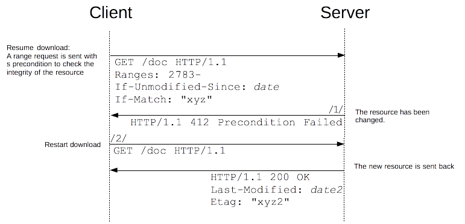

# HTTP - 条件式请求与缓存

说到浏览器的文件缓存，就绕不开 HTTP 协议中的相关内容。在这里做一个梳理。

参考：

- [Google Web Fundamentals - HTTP 缓存](https://developers.google.com/web/fundamentals/performance/optimizing-content-efficiency/http-caching)
- [MDN web docs HTTP 缓存](https://developer.mozilla.org/zh-CN/docs/Web/HTTP/Caching_FAQ)
- [MDN web docs HTTP 条件请求](https://developer.mozilla.org/zh-CN/docs/Web/HTTP/Conditional_requests)
- [.Net 基于时间的缓存策略](https://docs.microsoft.com/zh-cn/dotnet/framework/network-programming/time-based-cache-policies) （微软家果然和别人不太一样233）

- [baitouwei App-缓存方案：Http-缓存](http://www.baitouwei.com/2016/04/20/App-缓存方案：Http-缓存)
- [zhanglun 浅谈 HTTP 缓存](http://zhanglun.xyz/2019/03/09/浅谈-HTTP-缓存/)

## 条件式请求（Conditional Requests）

HTTP 中的条件式请求，指的是请求的执行结果会因特定首部的值以及有关资源的状态的不同而不同。这些首部实际上就是请求的前置条件，故会影响请求的最终结果。

- 对于“安全方法”（如 `GET`、`HEAD`），条件请求可以用来限定仅在满足某些条件的情况下才返回文件，可以减少必要的重复访问，节省带宽。
- 对于“非安全方法”（如 `PUT`），条件请求可以用来限定仅在满足文件的初始版本与服务器版本相同时才将其上传，防止例如上传了不同版本的不同部分之类的问题。

具体例子会在后面介绍。

### 验证器（Validators）

所有的验证器都会试图去检测服务器上存储的资源是否与某一特定版本相匹配。他们都是用来描述这一版本的值，分两大类：

- 文件的最后修改时间，即 `Last-Modified`
- 指代唯一版本的“实体标签” `ETag`

验证策略也分两大类：

- 强验证，即要求文件逐字节都一一对应，比如进行断点续传时使用；同时也是 HTTP 协议的默认验证策略
- 弱验证，用于客户代理确认资源内容“相同”即可，比如 html 文件中广告或者页脚的时间不同，这些复杂和细致的逻辑大多数由客户代理自己实现

> 验证类型与验证器的类型是相互独立的。 `Last-Modified` 和 `ETag` 首部均可应用于两种验证类型，尽管在服务器端实现的复杂程度可能会有所不同。

### 条件式请求的一般过程

No Magic，就是正常的、无状态、多带了一些 Header 和预制实现的服务器处理逻辑的 HTTP 访问。

当然条件请求所返回的 Code 不止上图所示的三种。

### 条件首部（Conditional Headers）

- `If-Match <ETag>, <ETag>, ... or *`

  若远端资源的实体标签与此处列出值有相同的，则匹配成功

- `If-None-Match <ETag>, <ETag>, ... or *`

  若远端资源的实体标签与此处列出值均不相同的，则匹配成功

- `If-Modified-Since <HTTP time>`

  若远端资源的 `Last-Modified` 标识日期比该列出值晚，则匹配成功

- `If-Unmodified-Since <HTTP time>`

  若远端资源的 `Last-Modified` 标识日期比该列出值早，或与之相等，则匹配成功

- `If-Range <ETag> or <HTTP time>`

  若远端资源的实体标签与此处列出值相同；或`Last-Modified` 标识日期比该列出值早或与之相等：则匹配成功

  匹配成功后才能使首部字段 `Range` 生效，并返回 `206`

  匹配失败则试图返回整个文件和 `200`

### 应用场景

#### 缓存更新

- 一开始缓存为空

  

  当然这里的验证器 `ETag` 和 `Last-Modified` 可以只返回其一。

- 通过 `Cache-Control` 和其他浏览器策略判断缓存是否失效，若失效，则向服务器验证资源。

- 若资源未变化，返回 `304 Not Modified`，客户端缓存进行刷新。虽然会产生一次网络访问，但是比重新下载整个资源高效的多

  

- 若资源变化了，即**条件首部被匹配**，则返回 `200 OK` 和新的资源

  

#### 增量下载的完整性

如果文件很大，则需要用到 HTTP 提供的增量下载功能。

- 请求方一开始当然不知道文件需要增量下载，正常发出 `GET` 请求，对方则会用 `Accept-Ranges` 提示客户端自己有增量下载的能力

  

- 此后客户端通过发送首部字段 `Ranges` 进行断点续传。这里用到两个条件首部确认下载过程中服务器上的这个文件没有被更改过

  

  其中请求结果中的 `Content-Range` 结构为 `<start>-<end>/<total>`

- 如果下载期间文件发生更改，若不加以任何处理，势必会引起客户端收到一个错误的、两个版本强行拼凑起来的版本。此时我们加上的条件首部会让服务器返回错误提示

  

- 我们还可以用 `If-Range`，避免上图中的过程 `/1/` 和 `/2/`，减少客户端处理异常和反复通信的开销

  

#### 使用乐观锁避免更新丢失问题

假设现在有一个 wiki 网站，远程更新文件是一个常见操作，这个过程一般如下：

但如果考虑并发，就会出现两个客户下载了相同版本的资源，却分别上传了自己修改后的版本。若不做任何验证，后被处理的一方很有可能会将前者的改动覆盖掉，对于 HTTP 来说，这几乎是无法处理的：

所谓乐观锁算法，在这里实际上就是：

- 允许所有客户端获得资源副本，使大家能同时在本地编辑
- 只允许第一个客户端成功提交
- 所有基于相对目前版本已过期的版本而提交的操作均会被拒绝

> 不存在解决这一问题而不打扰双方某一方的办法。然而，更新丢失问题以及竞态条件是需要避免的。我们希望获得可预测的结果，并且希望在更新操作被拒绝的时候客户端可以得到反馈。

在这里我们使用 `If-Match` 或 `If-Unmodified-Since` 就可以方便的实现乐观锁：

收到错误后我们就可以有机会为客户提供其他的业务逻辑完成基于最新版本的修改。

#### 处理创建资源的冲突问题

类似上面文件更新的竞态，创建资源也可能形成竞态。我们可以添加 `If-None-Match: *`，来确保只允许第一个创建资源的请求：

## 缓存控制 （Cache-Control 和它的小伙伴们）

首先我们来澄清两个已经不推荐使用的 header：

- `expires <HTTP time>`

  在所指示的时间之后，消息对象过期。

  优先级低于 `Cache-Control` 中的 `max-age` 和 `s-max-age`。

- `pragma: no cache`

  行为和 `Cache-Control: no-cache` 相同。

在 HTTP/1.1 下，我们完全可以只使用 `Cache-Control` 完成缓存控制。

### `Cache-Control` Header

#### 禁止进行缓存

`Cache-Control: no-store`

缓存中不得存储任何关于客户端请求和服务端相应的内容。每次客户端发起的请求都会下载完整的资源内容。

#### 强制确认缓存

`Cache-Control: no-cache`

每次请求发出时，缓存器都会携带相关字段向服务器进行验证。如前文所述，未过期时服务器返回 `304`，缓存器使用缓存版本；反之服务器返回完整文件。

#### 私有缓存和公共缓存

- `Cache-Control: public`

  该响应可以被任何中间人（比如中间代理、CDN 等）缓存，当然同时浏览器也会缓存。

- `Cache-Control: private`

  该响应只能被浏览器的私有缓存器缓存，比如账号密码订单信息等敏感页面。

#### 缓存过期机制

过期机制中最重要的指令就是 `max-age=<seconds>`，表示该资源在多少秒内可以看作“新鲜的”。

`s-max-age` 与其作用相似，但只作用于公共缓存中。

其中所谓的 age，实际上就是 [HTTP Header 中的 `Age` 字段](https://developer.mozilla.org/zh-CN/docs/Web/HTTP/Headers/Age)。

#### 缓存可用机制

除 `max-age=<seconds>` 外，`max-stable=<seconds>` 和 `min-fresh=<seconds>` 也会影响缓存资源的可用性。一个资源是否可用，大致遵循以下过程:

- `age + min-fresh < max-age` 缓存未过期
- `age + min-fresh >= max-age && age + min-fresh < max-age + max-stable` 缓存过期但仍可用
- `age + min-fresh > max-age + max-stable` 缓存过期且不可用

#### 缓存验证确认

使用 `Cache-Control: must-revalidate` 指令，会使得缓存器对所有过期的资源都必须向服务器验证它的状态。实际上就是跳过了上文“缓存过期但仍可用”这一阶段，只要过期就算作不可用。

### 缓存控制的一般过程

注意上图中的 Cache 实质上是指一个类似缓存代理的服务器。当然浏览器缓存器的控制过程也类似。

## 废弃或更新缓存

考虑如下这种情况，客户端在无缓存的情况下向服务器请求了 HTML 文件 `/page`，其中引用了文件 `/style.css`、`/script.js` 和 `/photo.jpg`。为了降低带宽开销，这些文件都声明 `max-age=<86400>`（一天）。

一个客户在 0800 下载了这个网页，1300 时开发者上传了新版本，但是因为 `max-age`，客户打开的网页读取了本地缓存，仍然是旧的。

这样显然不好，就产生了一个问题，**如何才能鱼和熊掌兼得：客户端缓存和快速更新？**

这就引出了现在非常常见的处理方式，文件指纹：

我们声明 `/page` 是 `no-cache` 的，这样每次请求这个文件都会去向服务器验证，即可以保证页面没有更新时不用重复下载，也可以保证页面一旦产生更新就能拿到最新的版本；也由此，其引用的三个文件的文件名也会得到及时的更新。

## 强缓存与弱缓存

我没有在任何有关 HTTP 的官方文档中看到过这种分类，但是网络上很多博客却又会提到这一对“缓存策略”。在我看来这一种分类完全是多余的，同时他们也没有什么完整或者明晰的定义，也是导致交流时产生混淆的原因。我不赞成用强弱缓存来描述 HTTP 缓存机制中的任何过程或策略。

## `Vary`

这一头部字段我准备在另一篇关于“HTTP 内容协商机制”的文章中进行讨论。

在这里我们可以简单的这么认为：

- 内容协商相关的头字段不同，可以将同一个 URL 对应到内容不同的资源文件上。它们可能是因不同的文件类型、字符集、编码方式和语言（`Accept`、`Accept-Charset`、 `Accept-Encoding`、`Accept-Language`）而区分开的。
- HTTP 缓存机制可以区分不同的内容协商资源版本，分开缓存、分开查验新鲜度、分开向服务器重验证。
- `Vary` 是由服务器发送给客户端的，它能向客户端说明，这次传输的资源应当用什么内容协商头字段做版本区分。

## 制定缓存策略的策略

我对这方面没有什么很深的实践或见解，这里引用 [Google Web Fundamentals - 缓存检查清单](https://developers.google.com/web/fundamentals/performance/optimizing-content-efficiency/http-caching#缓存检查清单)里的介绍：

> 不存在什么最佳缓存策略。 您需要根据通信模式、提供的数据类型以及应用特定的数据更新要求，为每个资源定义和配置合适的设置，以及整体的“缓存层次结构”。
>
> 在制定缓存策略时，您需要牢记下面这些技巧和方法：
>
> - 使用一致的网址：如果您在不同的网址上提供相同的内容，将会多次提取和存储这些内容。 提示：请注意，[网址区分大小写](https://www.w3.org/TR/WD-html40-970708/htmlweb.html)。
> - 确保服务器提供验证令牌 (`ETag`)：有了验证令牌，当服务器上的资源未发生变化时，就不需要传送相同的字节。
> - 确定中间缓存可以缓存哪些资源：对所有用户的响应完全相同的资源非常适合由 CDN 以及其他中间缓存进行缓存。
> - 为每个资源确定最佳缓存周期：不同的资源可能有不同的更新要求。 为每个资源审核并确定合适的 `max-age`。
> - 确定最适合您的网站的缓存层次结构：您可以通过为 HTML 文档组合使用包含内容指纹的资源网址和短时间或 `no-cache` 周期，来控制客户端获取更新的速度。
> - 最大限度减少搅动：某些资源的更新比其他资源频繁。 如果资源的特定部分（例如 JavaScript 函数或 CSS 样式集）会经常更新，可以考虑将其代码作为单独的文件提供。 这样一来，每次提取更新时，其余内容（例如变化不是很频繁的内容库代码）可以从缓存提取，从而最大限度减少下载的内容大小。
