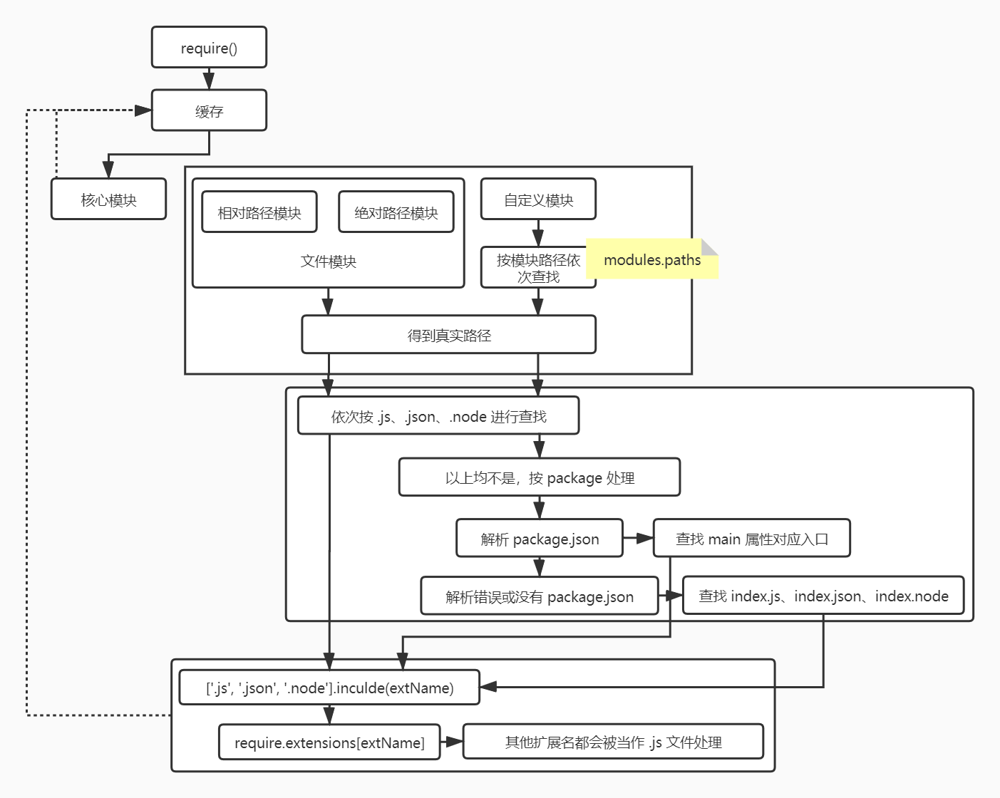

# 深入浅出 Node 读书笔记

## Node 简介

### 前端开发与 Node

Chrome 使用 V8 作为 JavaScript 引擎，V8 也给予 Chrome 与 JavaScript 强大的竞争力。JavaScript 在浏览器中被限制在沙箱中运行，其能力取决于浏览器中间层提供的支持有多少。

> 目前主流浏览器的 JavaScript 引擎如下:
> 
> | 浏览器 | 内核 |
> | ------| ---- |
> | Chrome | V8 |
> | Firefox | SpiderMonkey |
> | Edge | ChakraCore / V8 |
> | Safari | JavaScriptCore |


和浏览器类似，浏览器通过事件驱动服务界面上的交互，**Node 通过事件来驱动服务 I/O**。Node 可以通过事件驱动，其基础之一是底层大量的异步 I/O API，比如 `fs`、`net`、`dgram`、`http`、`tls` 等等。

开发上和前端开发类似，Node 也使用函数作为异步调用的基础单位（不论是将函数做参数，还是使用 `await/async`，函数都是“基础单位”）。前端开发过程中积累的函数式编程思想可以很自然的平移到 Node 开发中来。

同时，Node 也保持了 JavaScript 在浏览器中的单线程特点，同样使用 EventLoop 实现异步 I/O；但同时也提供 `child_process` 模块来创建、管理子线程，使 Node 可以充分利用多核心硬件，给了开发者一个良好的方案去解决主线程阻塞等问题。

## Node 的模块机制

### 历史与现状

> 参考：
> - https://juejin.im/entry/6844904056847073293
> - https://nodejs.org/api/esm.html
> - http://www.ruanyifeng.com/blog/2012/11/require_js.html
> - https://github.com/seajs/seajs/issues/242
> - https://github.com/seajs/seajs/issues/588
> - https://www.cyj.me/programming/2018/05/23/about-module-ii/

目前，Node（v14.13.1）依然将 [CommonJS 作为默认的模块化方案](https://nodejs.org/api/esm.html)，同时可以通过 `*.mjs` 的文件使用 ES 模块化方案。

#### “上古时期”

在 CommonJS 之前，模块化开发只能依赖于类似命名空间的方式进行，比如：

```js
// 代码来自：https://github.com/seajs/seajs/issues/547
var org = {};
org.CoolSite = {};
org.CoolSite.Utils = {};

org.CoolSite.Utils.each = function(arr) {
  // 实现代码
};

org.CoolSite.Utils.log = function(str) {
  // 实现代码
};
```

显然，如果你编写的模块和其他人的模块命名空间一致，那就会导致有一方的模块无法被使用了。虽然可以用闭包解决一部分作用域的问题，但当依赖关系较复杂时，开发人员没办法知道模块正确的前后加载关系，更无法高效的排查隐含的命名冲突问题，按需加载等功能更是无从谈起。

#### CommonJS 和 NodeJS

JavaScript 诞生之初没有任何模块化的功能，CommonJS 的出现第一次“统一”了其模块化的规范，至少是在服务端开发上做到了统一和解决。

> 实际上，CommonJS 的不仅仅只有模块化的相关内容，CommonJS 还试图指导 JavaScript 的很多基础功能的实现，比如 Buffer、I/O 流、文件管理、套接字，甚至单元测试和包管理等等，但 NodeJS 并没有全盘接受这些指导，其作者仅仅采纳了 CommonJS 中模块化内容，但大家依然称 NodeJS 的模块管理规范为 CommonJS。

CommonJS 将每个 js 文件当作一个模块，模块通过 `require` 引入外部模块，并通过 `exports` 对象唯一地导出当前模块的方法或变量。


CommonJS 的写法形如:

```js
// math.js
exports.add = function() {
  // ... ...
}

// program.js
var math = require('math');
exports.increment = function(value) {
  return math.add(value, 1);
}

// main.js
var $ = require('jquery');
var underscore = require('underscore');
var program = require('program');
// ... ...
```

#### AMD 和 RequireJS

但 CommonJS 有一个问题，CommonJS 所有的模块引用都是同步的，无法支持异步加载模块的行为。考虑到网络传输的不稳定性和延迟，CommonJS 无法在浏览器端方便的使用，这催生了异步加载模块的标准 AMD 和加载器 RequireJS 的出现。

AMD 使用 `define()` 来定义模块，使用 `require()` 引入其他模块，形如：

```js
// math.js
define(function() {
  var add = function() {
    // ... ...
  };
  return { add };
});

// program.js
define(['math'], function() {
  var increment = function(value) {
    return math.add(value, 1);
  };
  return { increment };
});

// main.js
require(['jquery', 'underscore', 'program'], function($, _, program){
  // some code here
});
```

同时，还可以通过 `require.config()` 自定义模块加载的行为，比如指定加载路径、加载非 AMD 规范的模块。也可以通过类似 `require(['domready!'], function() {})`、`define(['text!review.txt'], function() {})` 的方式使用插件来实现特定的功能。

#### CMD 和 SeaJS

但 [玉伯](https://github.com/lifesinger) 认为 [RequireJS 不够完善](https://github.com/seajs/seajs/issues/588)，核心观点包括：

- RequireJS 中的 `require()` 有多重用法，对于新手来说很容易出错，也不容易被用户很好的理解。
- 申明依赖的写法对改动不友好，当代码中去掉对某一模块的调用后，很容易在申明处留下多余的申明。
- RequireJS 太大，作为模块加载程序，他应该更小，更快。
- 在实际实践中，RequireJS 的源代码包含许多不必要的函数，但又无法去除。

总之，都是非常实战派的观点。由此，玉伯提出了 CMD 标准和 SeaJS。

CMD 使用 `define()` 来定义模块，使用 `require()` 和 `require.async()` 引入其他模块，形如：

```js
// math.js
define(function(require, exports, module) {
  exports.add = function() { /* ... */ };
  // or 
  return {
    add: function() { /* ... */ },
  }
  // or
  module.exports = {
    add: function() { /* ... */ },
  };
});

// program.js
define(function(require, exports) {
  var math = require('./math');
  exports.increment = function(value) {
    return math.add(value, 1);
  };
});

// main.js
define(function(require, exports) {
  var $ = require('jquery');
  var _ = require('underscore');
  var program = require('./program');
  // some code here
});
```

#### ES Module

2015 年 6 月，ECMAScript 6 标准正式发布，在语言标准层面规定了模块化的规范，试图成为浏览器和服务端的通用解决方案。

ES Module 使用 `import` 引入模块，使用 `export` 对外输出模块，形如:

```js
// math.js
const add = function() { /* ... */ };
export { add };

// program.js
import * as math from './math';
const increment = function(value) {
  return math.add(value, 1);
};
export { increment };

// main.js
import $ from 'jquery';
import _ from 'underscore';
import * as program from './program';
```

### Node 对模块化的具体实现

上文已经说明，Node 对 CommonJS 实际上是有选择的去实现的。实际上在 Node 中使用 `require()`，经历了如下三个步骤：

- 路径分析
- 文件定位
- 编译执行



其中编译各类文件还有如下细节:

- 编译 `.js`

    将正常的 `.js` 文件通过 `(function(export, require, module, __filename, __dirname)) {  }` 包裹起来，并交由 [`vm.runInThisContext()`](https://nodejs.org/api/vm.html#vm_vm_runinthiscontext_code_options) 执行，得到一个函数 `f()`，最后将当前模块的 `export` 对象、`require()` 方法、对象模块自身、通过文件定位得到的完整文件路径和文件目录作为参数传递给 `f()` 执行。

    这样，Node 就实现了 CommonJS 模块规范。

- 编译 `.node`

    Node 调用 [`process.dlopen()`](https://nodejs.org/api/process.html#process_process_dlopen_module_filename_flags) 加载并执行 C/C++ 模块，这个方法在不同的操作系统上有不同实现，最终将 `exports` 对象返回给调用方。

- 编译 `.json`

    Node 利用 `fs` 模块读取文件后调用 `JSON.parse()` 即得到这个 JSON 对象。

### Node 对核心模块的处理

上文明了 Node 对文件模块和自定义模块的处理过程，这里讨论 Node 对核心模块的处理。核心模块分为两部分：

- 仅由 JavaScript 编写的模块
- 有 C/C++ 参与编写的模块

#### JavaScript 核心模块

- 通过 js2c.py 将 JavaScript 代码转化为 C++ 数组，以字符串的形式存储在内存中。
- 与其他 JavaScript 模块相同，添加头尾包装，编译后存放在缓存中（`NativeModule.cache`）。

#### C/C++ 核心模块

很多 Node 的核心模块都是由 C/C++ 实现核心部分，再由 JavaScript 包装导出来使用的，比如 `buffer`、`fs` 等，这样既可以保证核心部分的运行效率，又可以提高编写的速率。

由 C/C++ 编写的部分称之为核心模块。这些模块通常不被用户直接使用，而是通过 Node 的 `get_builtin_module()` 方法取出。多层包装后，开发者只需要通过 `require()` 即可访问到这些核心模块。


### 包管理与 NPM

前文提到 CommonJS 不止有有关模块管理的内容，还包括包管理，最初使用 package.json 进行工程管理的规范，也同样是由 CommonJS 进行定义的。

日常开发中使用的 npm，是在 CommonJS 包管理规范的基础上做了大量修改和定义后，来组织、使用 package.json 文件的。具体规范可以见[这里](https://docs.npmjs.com/files/package.json)。

> 有关 npm 文件优先级的文章可以见[这里](https://github.com/SunshowerC/blog/issues/8)。


## 异步 I/O

### 为什么要异步

作者通过两个方面阐述了 Node 使用异步 I/O 的必要性：

- 用户体验

    作者认为，Web 2.0 的成功离不开异步概念。将数据处理、网络交互等过程和界面交互分离，两者互相异步，是 Web 2.0 完胜 B/S 模型的一大法宝。异步处理这些内容，可以保证浏览器在等待数据的过程中，还能给用户提供流畅漂亮的 UI；异步处理同样能并发的请求资源，更能发挥分布式服务的优势。

- 资源分配

    作者认为，如果说用户体验在浏览器端体现的更明显，那么从资源角度讲，对服务端的作用就更加明晰了。Web 服务器更多的是要面大量的、对互不相关的任务，每个任务通常是由 I/O 与 CPU 计算穿插进行的。

    I/O 过程明显慢于 CPU 计算，如果使用单线程串行完成，将会对 CPU 资源造成浪费；如果使用多线程并行完成，线程间通讯又成了大问题，如果同时执行一组任务，很难优雅的分发到多个进程上。

    Node 的优势就在于，其既可以利用单线程，让开发者远离多线程死锁、状态同步的问题；又可以利用异步 I/O，让单线程原理阻塞；同时还提供子进程功能灵活使用多个核心。

### 操作系统的异步 I/O 与非阻塞 I/O

在 Node 看来，异步与非阻塞好像是一回事，但是从操作系统的角度看，I/O 无所谓同步与异步，只有阻塞与非阻塞之分。


操作系统对计算机进行了抽象，将各种输入设备抽象成文件。同时系统内核使用文件描述符对 I/O 进行管理。

阻塞式 I/O 实际上是通过一次文件描述符打开的过程，拿取了全部的文件数据；而非阻塞式 I/O，则需要再通过一次或多次打开文件描述符，来获取文件里的数据。

换言之，非阻塞式 I/O 虽然没有浪费 CPU 时间片，但也没有直接拿回数据。后续的重复打开文件描述符的过程，即被称之为**轮询**，对于这些技术的详细介绍可以见[这里](https://www.jianshu.com/p/397449cadc9a)。

不难发现，使用轮询做非阻塞 I/O，CPU 要么处于遍历文件描述符的状态，要么在休眠等待事件发生，都不够理想。理想状态下，异步的 I/O 应当如此：


目前没有很好的、由操作系统原生支持的异步 I/O 方案，但可以通过多线程 I/O 的方式来获得类似的效果：


Node 提供了一层抽象 `libuv`，使得其在 *nix 系统上使用自定义线程池实现异步 I/O，在 Windows 系统上使用 IOCP 实现。

当然，

### Node 的异步 I/O
