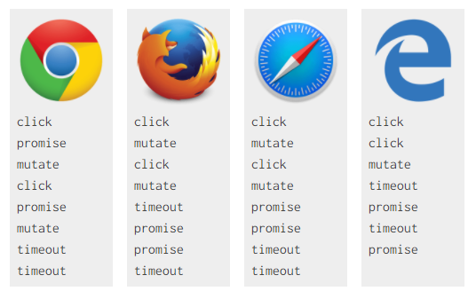
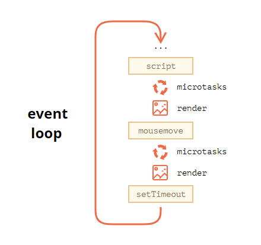

# 深入浅出 Node 读书笔记

## Node 简介

### 前端开发与 Node

Chrome 使用 V8 作为 JavaScript 引擎，V8 也给予 Chrome 与 JavaScript 强大的竞争力。JavaScript 在浏览器中被限制在沙箱中运行，其能力取决于浏览器中间层提供的支持有多少。

> 目前主流浏览器的 JavaScript 引擎如下:
> 
> | 浏览器 | 内核 |
> | ------| ---- |
> | Chrome | V8 |
> | Firefox | SpiderMonkey |
> | Edge | ChakraCore / V8 |
> | Safari | JavaScriptCore |


和浏览器类似，浏览器通过事件驱动服务界面上的交互，**Node 通过事件来驱动服务 I/O**。Node 可以通过事件驱动，其基础之一是底层大量的异步 I/O API，比如 `fs`、`net`、`dgram`、`http`、`tls` 等等。

开发上和前端开发类似，Node 也使用函数作为异步调用的基础单位（不论是将函数做参数，还是使用 `await/async`，函数都是“基础单位”）。前端开发过程中积累的函数式编程思想可以很自然的平移到 Node 开发中来。

同时，Node 也保持了 JavaScript 在浏览器中的单线程特点，同样使用 EventLoop 实现异步 I/O；但同时也提供 `child_process` 模块来创建、管理子线程，使 Node 可以充分利用多核心硬件，给了开发者一个良好的方案去解决主线程阻塞等问题。

## Node 的模块机制

### 历史与现状

> 参考：
> - https://juejin.im/entry/6844904056847073293
> - https://nodejs.org/api/esm.html
> - http://www.ruanyifeng.com/blog/2012/11/require_js.html
> - https://github.com/seajs/seajs/issues/242
> - https://github.com/seajs/seajs/issues/588
> - https://www.cyj.me/programming/2018/05/23/about-module-ii/

目前，Node（v14.13.1）依然将 [CommonJS 作为默认的模块化方案](https://nodejs.org/api/esm.html)，同时可以通过 `*.mjs` 的文件使用 ES 模块化方案。

#### “上古时期”

在 CommonJS 之前，模块化开发只能依赖于类似命名空间的方式进行，比如：

```js
// 代码来自：https://github.com/seajs/seajs/issues/547
var org = {};
org.CoolSite = {};
org.CoolSite.Utils = {};

org.CoolSite.Utils.each = function(arr) {
  // 实现代码
};

org.CoolSite.Utils.log = function(str) {
  // 实现代码
};
```

显然，如果你编写的模块和其他人的模块命名空间一致，那就会导致有一方的模块无法被使用了。虽然可以用闭包解决一部分作用域的问题，但当依赖关系较复杂时，开发人员没办法知道模块正确的前后加载关系，更无法高效的排查隐含的命名冲突问题，按需加载等功能更是无从谈起。

#### CommonJS 和 NodeJS

JavaScript 诞生之初没有任何模块化的功能，CommonJS 的出现第一次“统一”了其模块化的规范，至少是在服务端开发上做到了统一和解决。

> 实际上，CommonJS 的不仅仅只有模块化的相关内容，CommonJS 还试图指导 JavaScript 的很多基础功能的实现，比如 Buffer、I/O 流、文件管理、套接字，甚至单元测试和包管理等等，但 NodeJS 并没有全盘接受这些指导，其作者仅仅采纳了 CommonJS 中模块化内容，但大家依然称 NodeJS 的模块管理规范为 CommonJS。

CommonJS 将每个 js 文件当作一个模块，模块通过 `require` 引入外部模块，并通过 `exports` 对象唯一地导出当前模块的方法或变量。


CommonJS 的写法形如:

```js
// math.js
exports.add = function() {
  // ... ...
}

// program.js
var math = require('math');
exports.increment = function(value) {
  return math.add(value, 1);
}

// main.js
var $ = require('jquery');
var underscore = require('underscore');
var program = require('program');
// ... ...
```

#### AMD 和 RequireJS

但 CommonJS 有一个问题，CommonJS 所有的模块引用都是同步的，无法支持异步加载模块的行为。考虑到网络传输的不稳定性和延迟，CommonJS 无法在浏览器端方便的使用，这催生了异步加载模块的标准 AMD 和加载器 RequireJS 的出现。

AMD 使用 `define()` 来定义模块，使用 `require()` 引入其他模块，形如：

```js
// math.js
define(function() {
  var add = function() {
    // ... ...
  };
  return { add };
});

// program.js
define(['math'], function() {
  var increment = function(value) {
    return math.add(value, 1);
  };
  return { increment };
});

// main.js
require(['jquery', 'underscore', 'program'], function($, _, program){
  // some code here
});
```

同时，还可以通过 `require.config()` 自定义模块加载的行为，比如指定加载路径、加载非 AMD 规范的模块。也可以通过类似 `require(['domready!'], function() {})`、`define(['text!review.txt'], function() {})` 的方式使用插件来实现特定的功能。

#### CMD 和 SeaJS

但 [玉伯](https://github.com/lifesinger) 认为 [RequireJS 不够完善](https://github.com/seajs/seajs/issues/588)，核心观点包括：

- RequireJS 中的 `require()` 有多重用法，对于新手来说很容易出错，也不容易被用户很好的理解。
- 申明依赖的写法对改动不友好，当代码中去掉对某一模块的调用后，很容易在申明处留下多余的申明。
- RequireJS 太大，作为模块加载程序，他应该更小，更快。
- 在实际实践中，RequireJS 的源代码包含许多不必要的函数，但又无法去除。

总之，都是非常实战派的观点。由此，玉伯提出了 CMD 标准和 SeaJS。

CMD 使用 `define()` 来定义模块，使用 `require()` 和 `require.async()` 引入其他模块，形如：

```js
// math.js
define(function(require, exports, module) {
  exports.add = function() { /* ... */ };
  // or 
  return {
    add: function() { /* ... */ },
  }
  // or
  module.exports = {
    add: function() { /* ... */ },
  };
});

// program.js
define(function(require, exports) {
  var math = require('./math');
  exports.increment = function(value) {
    return math.add(value, 1);
  };
});

// main.js
define(function(require, exports) {
  var $ = require('jquery');
  var _ = require('underscore');
  var program = require('./program');
  // some code here
});
```

#### ES Module

2015 年 6 月，ECMAScript 6 标准正式发布，在语言标准层面规定了模块化的规范，试图成为浏览器和服务端的通用解决方案。

ES Module 使用 `import` 引入模块，使用 `export` 对外输出模块，形如:

```js
// math.js
const add = function() { /* ... */ };
export { add };

// program.js
import * as math from './math';
const increment = function(value) {
  return math.add(value, 1);
};
export { increment };

// main.js
import $ from 'jquery';
import _ from 'underscore';
import * as program from './program';
```

### Node 对模块化的具体实现

上文已经说明，Node 依然默认使用 CommonJS 的方案来实现模块化，同时实际上是有选择的去实现 CommonJS 的。实际上在 Node 中使用 `require()`，经历了如下三个步骤：

- 路径分析
- 文件定位
- 编译执行


其中编译各类文件还有如下细节:

- 编译 `.js`

    将正常的 `.js` 文件通过 `(function(export, require, module, __filename, __dirname)) {  }` 包裹起来，并交由 [`vm.runInThisContext()`](https://nodejs.org/api/vm.html#vm_vm_runinthiscontext_code_options) 执行，得到一个函数 `f()`，最后将当前模块的 `export` 对象、`require()` 方法、对象模块自身、通过文件定位得到的完整文件路径和文件目录作为参数传递给 `f()` 执行。

    这样，Node 就实现了 CommonJS 模块规范。

- 编译 `.node`

    Node 调用 [`process.dlopen()`](https://nodejs.org/api/process.html#process_process_dlopen_module_filename_flags) 加载并执行 C/C++ 模块，这个方法在不同的操作系统上有不同实现，最终将 `exports` 对象返回给调用方。

- 编译 `.json`

    Node 利用 `fs` 模块读取文件后调用 `JSON.parse()` 即得到这个 JSON 对象。

### Node 对核心模块的处理

上文明了 Node 对文件模块和自定义模块的处理过程，这里讨论 Node 对核心模块的处理。核心模块分为两部分：

- 仅由 JavaScript 编写的模块
- 有 C/C++ 参与编写的模块

#### JavaScript 核心模块

- 通过 js2c.py 将 JavaScript 代码转化为 C++ 数组，以字符串的形式存储在内存中。
- 与其他 JavaScript 模块相同，添加头尾包装，编译后存放在缓存中（`NativeModule.cache`）。

#### C/C++ 核心模块

很多 Node 的核心模块都是由 C/C++ 实现核心部分，再由 JavaScript 包装导出来使用的，比如 `buffer`、`fs` 等，这样既可以保证核心部分的运行效率，又可以提高编写的速率。

由 C/C++ 编写的部分称之为核心模块。这些模块通常不被用户直接使用，而是通过 Node 的 `get_builtin_module()` 方法取出。多层包装后，开发者只需要通过 `require()` 即可访问到这些核心模块。


### 包管理与 NPM

前文提到 CommonJS 不止有有关模块管理的内容，还包括包管理，最初使用 package.json 进行工程管理的规范，也同样是由 CommonJS 进行定义的。

日常开发中使用的 npm，是在 CommonJS 包管理规范的基础上做了大量修改和定义后，来组织、使用 package.json 文件的。具体规范可以见[这里](https://docs.npmjs.com/files/package.json)。

> 有关 npm 文件优先级的文章可以见[这里](https://github.com/SunshowerC/blog/issues/8)。


## 异步 I/O

### 为什么要异步

作者通过两个方面阐述了 Node 使用异步 I/O 的必要性：

- 用户体验

    作者认为，Web 2.0 的成功离不开异步概念。将数据处理、网络交互等过程和界面交互分离，两者互相异步，是 Web 2.0 完胜 B/S 模型的一大法宝。异步处理这些内容，可以保证浏览器在等待数据的过程中，还能给用户提供流畅漂亮的 UI；异步处理同样能并发的请求资源，更能发挥分布式服务的优势。

- 资源分配

    作者认为，如果说用户体验在浏览器端体现的更明显，那么从资源角度讲，对服务端的作用就更加明晰了。Web 服务器更多的是要面大量的、对互不相关的任务，每个任务通常是由 I/O 与 CPU 计算穿插进行的。

    I/O 过程明显慢于 CPU 计算，如果使用单线程串行完成，将会对 CPU 资源造成浪费；如果使用多线程并行完成，线程间通讯又成了大问题，如果同时执行一组任务，很难优雅的分发到多个进程上。

    Node 的优势就在于，其既可以利用单线程，让开发者远离多线程死锁、状态同步的问题；又可以利用异步 I/O，让单线程原理阻塞；同时还提供子进程功能灵活使用多个核心。

### 操作系统的异步 I/O 与非阻塞 I/O

在 Node 看来，异步与非阻塞好像是一回事，但是从操作系统的角度看，I/O 无所谓同步与异步，只有阻塞与非阻塞之分。


操作系统对计算机进行了抽象，将各种输入设备抽象成文件。同时系统内核使用文件描述符对 I/O 进行管理。

阻塞式 I/O 实际上是通过一次文件描述符打开的过程，拿取了全部的文件数据；而非阻塞式 I/O，则需要再通过一次或多次打开文件描述符，来获取文件里的数据。

换言之，非阻塞式 I/O 虽然没有浪费 CPU 时间片，但也没有直接拿回数据。后续的重复打开文件描述符的过程，即被称之为**轮询**，对于这些技术的详细介绍可以见[这里](https://www.jianshu.com/p/397449cadc9a)。

不难发现，使用轮询做非阻塞 I/O，CPU 要么处于遍历文件描述符的状态，要么在休眠等待事件发生，都不够理想。理想状态下，异步的 I/O 应当如此：


目前没有很好的、由操作系统原生支持的异步 I/O 方案，但可以通过多线程 I/O 的方式来获得类似的效果：


Node 提供了一层抽象 `libuv`，使得其在 *nix 系统上使用自定义线程池实现异步 I/O，在 Windows 系统上使用 IOCP 实现。

所以不难理解，JavaScript 是执行在单线程中的，但是 Node 是多线程的。Node 不单单包含一个执行 JavaScript 的线程，还包含多个 I/O 线程。同时 Node 会将这些 I/O 线程组织成线程池来使用。

### Node 的异步 I/O

> 参考：
> - https://nodejs.org/en/docs/guides/event-loop-timers-and-nexttick/
> - https://blog.insiderattack.net/event-loop-and-the-big-picture-nodejs-event-loop-part-1-1cb67a182810
> - https://set.sh/post/200317-how-nodejs-event-loop-works

事件循环（Event Loop）是 Node 的核心功能，它的存在使得 Node 处理 I/O 显得和其他任何编程平台都不一样。

#### 反应器模式

> 有关反应器模式的说明见[这里](https://en.wikipedia.org/wiki/Reactor_pattern)，同时可以参考[这里](http://www.blogjava.net/dlevin/archive/2015/09/02/427045.html)。
>
> 我认为将 Node 的事件循归为反应器模式的实现比归为生产-消费者模式更合适。可以这么简单的理解、阐述两者差异：前者的 Request Handler 是由 Service Handler 主动来触发、调用的；后者的消费者线程则不会依赖生产者线程唤醒、通知才会执行。当然两者还有很多别的区别和内容，但是上述这一点的差别最为明显。
>
> 当然后文会提到，Node 的事件循环也并非严格符合反应器模式的定义。设计模式的实际使用应当以解决真实问题为主。为遵守设计模式而编码，这一行为在实践过程中本身就是无意义的。

我们知道 Node 是工作在事件驱动模型下的，该模型包括了一个事件多路分解器（Event Demultiplexer）和一个事件队列（Event Queue）。所有的 I/O 请求最终都会生成一个完成/失败事件，或者其他触发了的事件，模型中将其统称为事件（Event）。事件处理的流程如下：

1. 事件多路分解器接收 I/O 请求，并将这些请求委托给适当的硬件。比如调用 `fs.open`，会按下图流程调用，最终这个 I/O 请求会发给事件多路分解器。


2. 一旦 I/O请求被处理完毕（例如，可读取文件中的数据，可读取套接字中的数据等），事件多路分解器便会添加这次请求所注册的回调函数。这些回调函数就被成为事件，这些事件会被加入到一个叫事件队列（Event Queue）的队列当中。

3. 当事件可以在事件队列中处理时，将按照接收顺序依次执行，直到队列为空。

4. 如果事件队列中没有事件，并且事件多路分解器也没有待处理的请求，则说明程序将执行完毕并退出。否则，回到第一步继续执行。

协调整个机制的程序被成为事件循环（Event Loop）。

当然，严格的来讲，Node 的事件循环远没有这么简单：

- 事件多路分解器在不同操作平台、执行不同 I/O 过程时，都可能是不同的组件。没有一个单一的组件能涵盖所有情况。
- 事件队列也不只有一个，并不是所有种类的事件都会被排进同一个队列里。
- 同时，I/O 事件也不是唯一一个会被排进队列里的事件类型。

#### 事件多路分解器

如上文所述，事件多路分解器并不是一个真实存在的“组件”，只是反应器模式中的一个抽象概念而已。

现实中，事件多路分解器在不同的操作系中名称各不相同，比如 Linux 的 `epoll`，macOS 中的 `kqueue`，Windows 中的 `IOCP` 等。Node 使用了这些已有功能实现了更高级的线程管理功能。

但实际上这些非阻塞方案并不能完全覆盖 Node 的所有功能和所有操作系统，用他们来执行网络 I/O 问题不大，但是在处理文件时，就会遇到诸如 Linux 不支持完全异步的访问文件、macOS 的文件异步访问会有限制等等问题。同样的，DNS 功能中有一部分会访问本地文件，所以也会出现访问文件不能完全异步的问题。

Node 为此引入了线程池的功能来支持 `epoll`、`kqueue` 和 `IOCP` 无法直接解决的 I/O 操作。

综上，Node 中不是所有的 I/O 功能都是在线程池中发生的，只有对于操作系统提供的异步 I/O 功能无法解决的 I/O 操作，才会使用线程池去解决。

> 同时要注意，Node 的线程池不仅仅执行 I/O 操作，一些 CPU 开销很大的加解密操作也是在线程池中运行的，比如 `crypto` 和 `zlib` 的一些功能。将这些 CPU 耗时很长的功能放在线程池中，可以有效防止事件循环执行单一任务时发生阻塞。

这样看来，为了跨平台的、统一的处理所有 I/O 和其他异步操作，应该需要抽出一层来屏蔽这些零碎又重要的复杂性，[`libuv`](http://docs.libuv.org/en/v1.x/design.html) 就是为此而诞生的。

以下是 `libuv` 官方文档中对自身架构的解释：


总而言之，Node 的反应器模型中事件多路分解器并不是一个原子的实体，而是由 `libuv` 抽象并暴露给 Node 的 I/O 操作的集合。同时，事件循环、事件排队机制等功能实际上也是由 `libuv` 提供的。

#### 事件循环（Event Loop）

事件循环应当是一种数据结构，其中所有的事件都依次进入循环队列并被处理，直到队列为空。与反应器模式的定义不同，Node 中有多个队列来管理事件，不同类型的事件会被排放在不同的队列中。

在处理完一个阶段、进入下一阶段之前，事件循环会处理两个中间队列，直到中间队列执行完毕。（所谓宏任务、微任务就是指这两类事件）。

`libuv` 处理的队列有如下四种：

- 过期计时器回调的队列：由 `setTimeout` 和 `setInterval` 的回调函数组成（实际上存储在一个最小堆中）
- I/O 事件队列：由已经执行完毕的 I/O 请求返回的事件组成
- 立即执行回调的队列：由 `setImmediate` 的回调函数组成
- 关闭句柄的队列：由 `close` 事件的句柄组成

还有两个中间队列，这两个中间队列实际上不是由 `libuv` 管理的，他们实际上属于 Node 本身来管理的：

- Next Tick 队列：由 `process.nextTick` 的回调函数组成
- 其他微任务队列：由诸如 `Promise` 的回调函数等微任务组成


如上图，事件循环从检查计时器回调队列开始，遍历每一个队列。处理完关闭句柄队列后，如果没有要处理或者需要等待的操作，就会退出整个循环，反之继续遍历整个循环。每个队列的处理过程可以成为事件循环的一个阶段（Phase）。

标红的部分就是中间队列，他们在每个阶段完成时执行。这些队列执行完毕后，才会执行下一个阶段。同时，v8 引擎中，Next Tick 队列会比其他微任务更优先的执行（其他引擎不一定如此）。

中间队列的这种执行机制还会引起一个问题：假如在 `process.nextTick` 递归的或生成无限多个 `process.nextTick` 调用，将会阻塞整个事件循环，事件循环就会停止循环，一直去处理 Next Tick 队列。

> 注意 Node v11 后，微任务会在每个计时器回调结束执行，而不是等待整个队列结束。这样可以保证浏览器和 Node 的 Javascript 代码行为一致。

最后，附上 `libuv` 在 Node 中的结构示意图：


### 浏览器的 Event Loop

> 参考：
> - https://jakearchibald.com/2015/tasks-microtasks-queues-and-schedules/
> - https://blog.insiderattack.net/javascript-event-loop-vs-node-js-event-loop-aea2b1b85f5c
> - https://zh.javascript.info/event-loop
> - https://zh.javascript.info/microtask-queue
> - https://html.spec.whatwg.org/multipage/webappapis.html#event-loops
> - https://github.com/aooy/blog/issues/5

从模式上将，浏览器和 Node 中的事件循环没有什么不同，他们都是一个循环遍历事件并去做触发后续工作的过程。

浏览器也会将各种各样的事件发送给事件循环，同样是由一个独立于 JavaScript 引擎的组件来处理这些事，比如在 Chrome 中，代替 `libuv` 的组件叫 `libevent`。

但是，两者在实现上有很多不同之处，比如浏览器中事件队列只有一个而非四个，微任务也不会有优先级的区分；甚至不同浏览器和其不同版本之间的现象也有所不同，这会导致各种各样有差异的行为。



> 形成以上结果的代码见[这篇文章](https://jakearchibald.com/2015/tasks-microtasks-queues-and-schedules/)的 Level 1 bossfight 一节。

同时两者处理的事件来源也不同，Node 中主要处理各种 I/O 事件，而浏览器则会处理用户交互，脚本执行，网络等事务，甚至还会参与界面渲染的协调。

#### 执行过程

[HTML 规范的 Processing model 一节](https://html.spec.whatwg.org/multipage/webappapis.html#event-loop-processing-model)详细约定了事件循环每一轮的工作过程，大致如下:

1. 设 `taskQueue` 是依照浏览器实现选取的一个至少含有一个任务的任务队列；若没有这样的队列，则跳转到处理微任务的步骤。
    > HTML 规范约定，浏览器可以维护多个事件循环。一般每一个窗口、iframe 和 worker 都会有一个自己的事件循环。
    >
    > 同时，HTML 规范约定，每个事件循环可以有一个或多个任务队列。但一般浏览器的实现都是一个事件循环对应一个任务队列。
2. 让最老的任务成为 `taskQueue` 中的第一个任务，之后从 `taskQueue` 中移除这个任务。
    > 暗示事件队列的实现可以不是队列，只要能有方法将最老的任务选为第一个任务即可。
3. 执行这个任务。
4. 执行完毕后，处理微任务队列。
5. 如果当前事件循环是一个[窗口事件循环](https://html.spec.whatwg.org/multipage/webappapis.html#window-event-loop)，执行渲染流程。
6. 如果当前事件循环是一个 [worker 事件循环](https://html.spec.whatwg.org/multipage/webappapis.html#worker-event-loop-2)，执行 worker 流程。

处理微任务的流程也是循环执行：

1. 若当前事件循环正在处理微任务队列（通过[一个布尔值](https://html.spec.whatwg.org/multipage/webappapis.html#performing-a-microtask-checkpoint)判断），则返回，不执行这次流程。
2. 设置当前事件循环正在处理微任务队列。
3. 循环处理微任务，直到微任务队列为空。同样，也是按微任务从老到新来执行。
    > 若有微任务 A、B，A 触发了另一个微任务 C，则 C 会在最后执行而不是紧接着 A 执行。
4. 微任务队列执行结束后，将 [rejected promises](https://html.spec.whatwg.org/multipage/webappapis.html#notify-about-rejected-promises) 通知发送给 [environment settings object](https://html.spec.whatwg.org/multipage/webappapis.html#environment-settings-object)。
    > 即此时 Promise.reject 才会开始抛出异常。
5. [清理 Indexed Database 事务](https://w3c.github.io/IndexedDB/#cleanup-indexed-database-transactions)。
6. 设置当前事件循环没有在处理微任务队列了。

如果发现某个浏览器的行为不是这样的，那只能说明这个浏览器没有遵循 HTML 的这些规范。这是经常发生的，也是导致浏览器某些行为不一致的原因。

#### 什么是 task

HTML 规范中，task 即指众所周知的宏任务，规范[定义了其来源](https://html.spec.whatwg.org/multipage/webappapis.html#generic-task-sources)：

- DOM 操作：例如一个元素以非阻塞的方式插入文档。
- 用户交互：例如键盘或鼠标输入。规范强调用户操作的事件必须使用任务队列来处理。
- 网络活动：例如响应 ajax 请求。
- 浏览器历史导航：用来执行 `history.back()` 这样的 API。

当然，时间触发器的回调也会进入事件队列，即 `setTimeout`、`setInterval` 和没多少浏览器支持的 `setImmediate`。

> `setTimeout` 最小延时的问题可以参考 https://developer.mozilla.org/zh-CN/docs/Web/API/Window/setTimeout 最小延时 一节。

同时要注意，浏览器执行脚本时，也会往队列里添加一个任务。

#### 什么是 micro task

HTML 规范中，micro task 即微任务。HTML 规范没有特别说明什么样的操作应当添加微任务到队列里。现实的浏览器中，微任务的来源只有如下几个：

- `Promise` 的回调。
- `MutationObserver` 的回调。
- 被废弃的 API `Object.observe` 的回调。

> 有些浏览器将 `Promise` 回调也放到宏任务队列里去执行，这同样会引起各种执行上的差异。

#### 小结

浏览器的事件循环图示如下：



但浏览器各个版本的事件循环会有不少差异，这些差异来自各浏览器遵守的规范版本不同、规范本身没有做强制约定、甚至是浏览器本身的 bug。